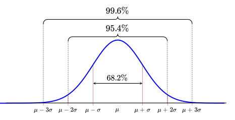

```{r setup, include = FALSE, cache = FALSE, purl = FALSE}
# output options
options(width = 70, scipen = 6, digits = 3)
library(knitr)
library(gridExtra)
library(cowplot)
library(ggplot2)
library(dplyr)

# chunk default options
opts_chunk$set(tidy = FALSE, fig.width = 7, fig.asp = 0.618, warning = FALSE, message = FALSE, cache = FALSE)

theme_set(theme_bw())
```


class: middle, center, inverse

.right[Целью моделирования является получение] 
.right[простых суммарных (сводных, итоговых)]
.right[характеристик набора данных.]
.right[(Уикем, Гроулмунд, 2018)]

# Модель нормального распределения

---

## Как передать информацию о большом наборе данных?


```{r}
set.seed(12345)
dat <- round(rnorm(100, 10, 2), 1)

dat
```


---
## Способ 1. 

Можно построить график.

.pull-left-40[
```{r}
df <- data.frame(X = dat)

Pl <-
  df %>% 
  ggplot()

Pl + geom_histogram(aes(x = X), bins = 10)
```
]

.pull-right-40[
```{r}

Pl + geom_boxplot(aes(y = X))

```
]

---

## Способ 2.


Можно охарактеризовать медиану и квартили.

```{r}
summary(dat)
```

Можно ли по этим данным "воспроизвести" исходный ряд?

---
## Способ 3.

Можно смоделировать данные 

.pull-left-40[

```{r, echo = FALSE}
Pl + 
  geom_point(aes(x = X, y =0), position = position_jitter(height = 0.002), color = "blue") + 
  ylim(-0.01, 0.1) +
  geom_hline(yintercept = 0) +
  xlim(0, 20) 

```

]

.pull-right-40[

```{r, echo = FALSE}
ND_curve <- ggplot(data = data.frame(x = 0:10), aes(x = x)) +
  stat_function(fun = dnorm, args = list(mean = 10, sd = 2), 
                colour = 'red3', size = 1) +
  labs(y = 'Плотность вероятности')+
  xlim(0, 20)
  
ND_curve + 
  geom_point(data = df, aes(x = X, y = 0), position = position_jitter(height = 0.004), color = "blue")
```

]

Эта модель описывается всего двумя числами 

$$
\mu = 5 \\
\sigma = 2
$$

Можно ли по этим данным "воспроизвести" исходный ряд?


---
## "Реконструируем" ряд по данным из модели


```{r, echo = FALSE, fig.align='center', fig.height=6}
df$X_new = rnorm(100, 10, 2)

library(reshape2)
df %>% 
  melt() %>% 
  ggplot(aes(x = variable, y = value)) +
  geom_boxplot()+
  labs(x = "", y = "Значения")
```


---

## Нормальное, или Гауссово, распределение

.center[]


---

## Нормальное распределение

.pull-left-66[
```{r g-norm, echo=FALSE, purl=FALSE}

ND_curve <- ggplot(data = data.frame(x = 0:20), aes(x = x)) +
  stat_function(fun = dnorm, args = list(mean = 10, sd = 2), 
                colour = 'red3', size = 1) +
  labs(y = 'Плотность вероятности')
ND_curve
```
]

.pull-right-33[
- симметричное 
- унимодальное
- непрерывное
]

.pull-left-66[
$$f(x) = \cfrac {1}{\sigma \sqrt{2 \pi}} \; e^{- \: \cfrac{(x-\mu)^2}{2\sigma^2}}$$

- $\mu$ --- среднее значение;
- $\sigma$ --- стандартное отклонение.


Это кратко записывается как $x \sim N(\mu, \sigma)$.
]


---

## Смысл параметров нормального распределения


```{r , echo=FALSE, purl=FALSE, fig.width=10, fig.asp=0.618}

ND_curve1 <- ggplot(data = data.frame(x = 0:30), aes(x = x)) +
  stat_function(fun = dnorm, args = list(mean = 10, sd = 3), 
                colour = 'red3', size = 1) +
  labs(y = 'Плотность вероятности') +
  xlim(0, 30)

ND_curve2 <- ggplot(data = data.frame(x = 0:30), aes(x = x)) +
  stat_function(fun = dnorm, args = list(mean = 10, sd = 1), 
                colour = 'red3', size = 1) +
  labs(y = 'Плотность вероятности') +
  xlim(0, 30)

ND_curve3 <- ggplot(data = data.frame(x = 0:30), aes(x = x)) +
  stat_function(fun = dnorm, args = list(mean = 10, sd = 2), 
                colour = 'red3', size = 1) +
  labs(y = 'Плотность вероятности') +
  xlim(0, 30)


ND_curve4 <- ggplot(data = data.frame(x = 0:30), aes(x = x)) +
  stat_function(fun = dnorm, args = list(mean = 20, sd = 2), 
                colour = 'red3', size = 1) +
  labs(y = 'Плотность вероятности') +
  xlim(0, 30)


plot_grid(ND_curve1, ND_curve3, ND_curve2, ND_curve4, ncol = 2, labels = "AUTO", label_x = 0.3, label_y = 0.9 )
```


.pull-left[
$$
\mu_A = \mu_C
;
\sigma_A > \sigma_C
$$
]

.pull-right[

$$
\mu_B < \mu_D
;
\sigma_B = \sigma_D
$$

]

---

## Стандартное нормальное распределение

```{r echo=FALSE, purl=FALSE}
ggplot(data = data.frame(x = -3.5:3.5), aes(x = x)) +
  stat_function(fun = dnorm, args = list(mean = 0, sd = 1), 
                colour = 'red3', size = 1) +
  scale_x_continuous(breaks = -3:3) +
  labs(x = 'z', y = 'Плотность вероятности')
```

$$N(0, 1)$$
Зачем нужно стандартизованное распределение?

--
Квантили в нормальном распределении зависят от $\mu$ и $\sigma$ и могут быть любыми.  

В **стандартизованном распределении** квантили строго определены! Это свойство используется для построения *статистических тестов*. 

---

## Квантили стандартизованного нормального распределения

```{r}
round(qnorm(p = c(0.025, 0.975), mean = 0, sd = 1), 2)

round(qnorm(p = c(0.95), mean = 0, sd = 1), 2)

```
 
Запомните эти числа на будущее!

---
## Стандартизация рспределения (Z-преобразование)


.pull-left[

```{r echo=FALSE, purl=FALSE, fig.width = 8, fig.height=10}
gg_sample <- ggplot(data = data.frame(x = 0:20), aes(x = x)) +
  stat_function(fun = dnorm, args = list(mean = 10, sd = 2), 
                colour = 'steelblue', size = 1) +
    theme(axis.text = element_text(size = 20),
        axis.title = element_text(size = 20)) +
    labs(y = ' ')

gg_z <- ggplot(data = data.frame(x = -5:5), aes(x = x)) +
  stat_function(fun = dnorm, args = list(mean = 0, sd = 1), 
                colour = 'red3', size = 1) +
  scale_x_continuous(breaks = -5:5) +
  theme(axis.text = element_text(size = 20),
        axis.title = element_text(size = 20)) +
  labs(x = 'z', y = ' ', size = 20)

gg_sample_z <- plot_grid(gg_sample, gg_z, ncol = 1, align = 'v')
ggdraw(gg_sample_z) + 
  draw_label('Плотность вероятности', angle = 90, x = 0.015, y = 0.5, size = 20, fontfamily = 'GT Eesti Pro Display')
```
]

.pull-right[
$$z = \frac{x - \mu}{\sigma}$$

После стандартизации любое нормальное распределение превращается в стандартное нормальное:

$$Z \sim N(0, 1)$$
]


---

## Стандартизация векторов


.pull-left[
```{r echo=FALSE, purl=FALSE, fig.width = 8, fig.height=10}
set.seed(4122113)

Xi <- round(rnorm(n = 10, mean = 10, sd = 2), 0)
Mu <- mean(Xi)
Sd <- sd(Xi)
Zi <- (Xi - Mu) / Sd
Z <- data.frame(Xi, Zi)

lab_sample <- substitute(paste('До стандартизации', ~bar(x)==Mu, ',  ', s==Sd),
                         list(Mu = format(Mu, digits = 1, nsmall = 0), 
                              Sd = format(Sd, digits = 1, nsmall = 2)))
lab_z <- expression(paste('После стандартизации', ~bar(z)==0, ',  ', s[z]==1))

gg_sample <- ggplot(data = Z, aes(x = Xi)) + 
  geom_dotplot(fill = 'green4') +
  scale_x_continuous(breaks = seq(0, 20, 1)) +
  geom_vline(xintercept = mean(Xi), 
             colour = 'steelblue') +
  geom_vline(xintercept = mean(Xi) + sd(Xi) * c(-1, 1), 
             colour = 'steelblue', linetype = 'dashed') + 
  labs(title = lab_sample, x = 'x') +
  theme(text = element_text(size = 20))
  

gg_z <- ggplot(data = Z, aes(x = Zi)) + 
  geom_dotplot(fill = 'red3') +
  geom_vline(xintercept = mean(Zi), 
             colour = 'red3') +
  geom_vline(xintercept = mean(Zi) + sd(Zi) * c(-1, 1), 
             colour = 'red3', linetype = 'dashed') +
  labs(title = lab_z, x = 'z') +
  theme(text = element_text(size = 20))
  
    

plot_grid(gg_sample + theme_void(),
          gg_z + theme_void(), 
          ncol = 1)
```
]

.pull-right[
$$z_i=\frac{x_i - \bar{x}}{sd}$$

Стандартизованная величина (Z-оценка) показывает, на сколько стандартных отклонений значение отличается от среднего

**После стандартизации всегда**:

- среднее $\bar{z} = 0$
- стандартное отклонение $sd_{z} = 1$

]

Зачем это нужно?

--
Стандартизация векторов применяется для их сравнения с предсказаниями модели стандартизованного нормального распределения.  


---

## Задание 1

- Стандартизуйте вектор `1:5`

- Вычислите среднее значение стандартизованного вектора?

- Вычислите стандартное отклонение стандартизованного вектора?


---

class: middle, center, inverse

# Проверка на нормальность

---
## Квантильный график

По оси $X$ отложены квантили стандартного нормального распределения, по оси $Y$ --- квантили данных. Если $x \sim N(\mu,\sigma)$, то точки лягут на прямую линию.

```{r echo=FALSE, purl=FALSE, fig.width=8}
library(car)
set.seed(9109)
x <- rnorm(n = 100, mean = 10, sd = 3)
par(mfrow = c(1, 2))
hist(x, nclass = 30, main = "")
qqPlot(x, id = FALSE)
par(mfrow = c(1, 1))

```

---
## Квантильный график вручную

.pull-left[
```{r}
norm_q <- qnorm(p = seq(0.01, 0.99, 0.01), mean = 0, sd = 1)
observ_q <- quantile(x, probs = seq(0.01, 0.99, 0.01))

```
]


.pull-right[
```{r echo=FALSE}
ggplot(data.frame(norm_q, observ_q), aes(norm_q, observ_q)) +
  geom_point() +
  geom_smooth(method = "lm", se = F, color = "red")
```
]

---

## Квантильный график в `R`

```{r fig.width=10}
set.seed(9128)
my_vector <- rnorm(n = 150, mean = 10, sd = 3)
library(car)
qqPlot(my_vector, id = FALSE) # квантильный график
```

---

## Задание 2

Выполните по одному блоки кода (см. код к этой презентации).

Что вы можете сказать о свойствах распределений, изображенных на квантильных графиках?

---

## Бимодальное (двувершинное) распределение

```{r echo=FALSE, fig.height=7, fig.width=12}
library(car)
set.seed(3287447)
x <-c(rnorm(n = 75, mean = 10, sd = 4), rnorm(n = 75, mean = 30, sd = 6))
par(mfrow = c(1, 2))
hist(x, nclass = 30, main = '')
qqPlot(x, id = FALSE)
par(mfrow = c(1, 1))
```

---

## Дискретное распределение с длинным правым хвостом


```{r echo=FALSE, fig.height=7, fig.width=12}
set.seed(8921)
x <- rpois(n = 100, lambda = 4)
par(mfrow = c(1, 2))
hist(x , nclass = 30, main = '')
qqPlot(x, id = FALSE)
par(mfrow = c(1, 1))
```

---

## Непрерывное распределение с толстыми хвостами


```{r echo=FALSE, fig.height=7, fig.width=12}
set.seed(49199158)
x <- rt(n = 150, df = 6)
par(mfrow = c(1, 2))
hist(x , nclass = 30, main = '')
qqPlot(x, id = FALSE)
par(mfrow = c(1, 1))
```

---

## Непрерывное распределение с длинным правым хвостом

```{r echo=FALSE, fig.height=7, fig.width=12}
set.seed(1298)
x <- rchisq(n = 150, df = 1)
par(mfrow = c(1, 2))
hist(x, nclass = 30, main = '')
qqPlot(x, id = FALSE)
par(mfrow = c(1, 1))
```

<!-- Если интересны подробности, можно посмотреть симуляции, например, здесь https://stats.stackexchange.com/questions/101274/how-to-interpret-a-qq-plot -->

---

## Задание 3

Проверьте при помощи квантильного графика, подчиняются ли эти переменные нормальному распределению:

- Рост американских женщин (датасет `women`)
- Длина чашелистиков у ирисов (датасет `iris`)
- Число пойманных рысей в Канаде с 1821 по 1934г. (датасет `lynx`)

---

## Решение (3.1)

```{r}
data("women")
str(women)
qqPlot(women$height, id = FALSE)
```

---

## Решение (3.2)

```{r}
data("iris")
str(iris)
op <- par(mfrow = c(1, 2))
qqPlot(iris$Sepal.Length, id = FALSE)
hist(iris$Sepal.Length)
par(op)
```

---

## Решение (3.3)

```{r}
data("lynx")
str(lynx)
op <- par(mfrow = c(1, 2))
qqPlot(lynx, id = FALSE)
hist(lynx)
par(op)
```

---

class: middle, center, inverse


# Оценка вероятностей при помощи распределений

---

## Эмпирическое правило нормального распределения

.center[

]
- 68% значений находятся в пределах 1 стандартного отклонения $\sigma$
- 95% значений --- в пределах 2 $\sigma$
- 99.7% значений --- в пределах 3 $\sigma$ 


---

## Модель нормального распределения позволяет оценивать вероятности событий

### Вероятности --- это площади под кривой распределения

```{r g-norm-interval, echo=FALSE, purl=FALSE}
ND_curve + 
    stat_function(geom = 'area', fun = dnorm, args = list(mean = 10, sd = 2), 
                  xlim = c(11, 14), alpha = 0.6, fill = 'red3')
```


$-\infty < x < +\infty$.

Площадь под всей кривой $= 1$.

Вероятность встречи значений из определенного промежутка можно узнать, проинтегрировав функцию распределения.

---


## Кривые распределений можно использовать для оценки вероятностей

```{r purl=FALSE, echo=FALSE, fig.height=5, fig.width=12}
mu <- 0; sig <- 1; X1 <- -2; X2 <- 2
dfr <- data.frame(z = seq(-4, 4, length.out = 1000))

gg_part <- ggplot(dfr, aes(x = z)) +
  scale_x_continuous(name = 'z', breaks = -3:3) +
  labs(y = 'Плотность вероятности') +
  geom_vline(xintercept = c(-0.5, 1.25), linetype = 'dashed', colour = 'red') +
  stat_function(geom = 'area', fun = dnorm, args = list(mean = mu, sd = sig), 
                size = 1, fill = 'red3', alpha = 0.5, xlim = c(-0.5, 1.25)) +
  stat_function(geom = 'line', fun = dnorm, args = list(mean = mu, sd = sig), 
                size = 1, colour = 'red3') +
  theme(text = element_text(size = 18))

gg_part +
annotate(geom = 'text', parse = TRUE,
           x = mu, y = 0.15, 
           label = "P")
```

---

## Площадь под всей кривой распределения равна 1


```{r purl=FALSE, echo=FALSE, fig.height=6, fig.width=12}
mu <- 0; sig <- 1; X1 <- -1.5; X2 <- 1.5
dfr <- data.frame(z = seq(-4, 4, length.out = 1000))

gg_all <- ggplot(dfr, aes(x = z)) +
  scale_x_continuous(name = 'z', breaks = -3:3) +
  labs(y = 'Плотность вероятности') + 
  stat_function(geom = 'area', fun = dnorm, args = list(mean = mu, sd = sig), 
                size = 1, fill = 'red3', alpha = 0.5) +
  stat_function(geom = 'line', fun = dnorm, args = list(mean = mu, sd = sig), 
                size = 1, colour = 'red3')

gg_all +
annotate(geom = 'text', parse = TRUE,
           x = mu, y = 0.15, 
           label = "P[group('(',list(-infinity, infinity),')')] == 1")
```

---

## Вероятность конкретного значения нельзя определить

```{r purl=FALSE, echo=FALSE, fig.height=6, fig.width=12}
gg_X1 <- ggplot(dfr, aes(x = z)) +
  scale_x_continuous(name = 'z', breaks = -3:3) +
  labs(y = 'Плотность вероятности') + 
    stat_function(geom = 'line', fun = dnorm, args = list(mean = mu, sd = sig), 
                  size = 1, colour = 'red3') +
  geom_vline(xintercept = X1, linetype = 'dashed', colour = 'red') +
  annotate('point', x = X1, y = dnorm(X1, mean = mu, sd = sig), 
           colour = 'red3', fill = 'lightblue', shape = 21, size = 3) +
  annotate(geom = 'text', parse = TRUE, 
             x = X1, y = dnorm(X1, mean = mu, sd = sig), 
             label = paste0("P[(x == ", X1, ")] == 0"), 
             hjust = 1.1, size = 6) +
  theme(text = element_text(size = 18))

gg_X1


```

---

## Можно определить вероятность того, что значение будет меньше заданного

```{r purl=FALSE, echo=FALSE, fig.height=5, fig.width=12}
gg_less_X2 <- ggplot(data = dfr, aes(x = z)) +
  geom_vline(xintercept = X2, linetype = 'dashed', colour = 'red') +
  scale_x_continuous(name = 'z', breaks = -3:3) +
  stat_function(fun = dnorm, args = list(mean = mu, sd = sig), 
                colour = 'red3', size = 3) +
  labs(x = 'Значение', y = 'Плотность вероятности') +
  stat_function(geom = 'area', fun = dnorm, args = list(mean = mu, sd = sig), 
                xlim = c(min(dfr$z), X2), alpha = 0.6, fill = 'red3') +
  theme(text = element_text(size = 18))

gg_less_X2 +
    annotate(geom = 'text', parse = TRUE, 
           x = X2, y = dnorm(X2, mean = mu, sd = sig), 
           label = paste0("P[(x <= ", X2, ")]"), 
           hjust = 1.1, size = 5)
```

---

## Остальные площади легко найти при помощи простых арифметических действий с площадями

```{r purl=FALSE, echo=FALSE, fig.height=6, fig.width=12}
gg_greater_X2 <- ggplot(data = dfr, aes(x = z)) +
  geom_vline(xintercept = X2, linetype = 'dashed', colour = 'red') +
  scale_x_continuous(name = 'z', breaks = -3:3) +
  stat_function(fun = dnorm, args = list(mean = mu, sd = sig), 
                colour = 'red3', size = 1) +
  labs(x = 'Значение', y = 'Плотность вероятности') +
  stat_function(geom = 'area', fun = dnorm, args = list(mean = mu, sd = sig), 
                xlim = c(X2, max(dfr$z)), alpha = 0.6, fill = 'red3')

gg_greater <- plot_grid(gg_greater_X2 + theme_void(), 
          gg_all + theme_void(), 
          gg_less_X2 + theme_void(), 
          nrow = 1)

gg_greater <- ggdraw(gg_greater) + 
  draw_label(label = '=', size = 20, x = 0.33, y = 0.5) +
  draw_label(label = '–', size = 20, x = 0.66, y = 0.5)

gg_between_X1X2 <- ggplot(data = dfr, aes(x = z)) +
  geom_vline(xintercept = X1, linetype = 'dashed', colour = 'red') +
  geom_vline(xintercept = X2, linetype = 'dashed', colour = 'red') +
  scale_x_continuous(name = 'z', breaks = -3:3) +
  stat_function(fun = dnorm, args = list(mean = mu, sd = sig), 
                colour = 'red3', size = 1) +
  labs(x = 'Значение', y = 'Плотность вероятности') +
  stat_function(geom = 'area', fun = dnorm, args = list(mean = mu, sd = sig), 
                xlim = c(X1, X2), alpha = 0.6, fill = 'red3')
gg_less_X1 <- ggplot(data = dfr, aes(x = z)) +
  geom_vline(xintercept = X1, linetype = 'dashed', colour = 'red') +
  scale_x_continuous(name = 'z', breaks = -3:3) +
  stat_function(fun = dnorm, args = list(mean = mu, sd = sig), 
                colour = 'red3', size = 1) +
  labs(x = 'Значение', y = 'Плотность вероятности') +
  stat_function(geom = 'area', fun = dnorm, args = list(mean = mu, sd = sig), 
                xlim = c(min(dfr$z), X1), alpha = 0.6, fill = 'red3')

gg_between <- plot_grid(gg_between_X1X2 + theme_void(),
                        gg_less_X2 + theme_void(), 
                        gg_less_X1 + theme_void(), 
                        nrow = 1)

gg_between <- ggdraw(gg_between) + 
  draw_label(label = '=', size = 20, x = 0.33, y = 0.5) +
  draw_label(label = '–', size = 20, x = 0.66, y = 0.5)

plot_grid(gg_greater, gg_between, nrow = 2)
```


---

## Пример: Размеры улиток

Cредний диаметр раковины улиток в популяции 5 см, стандартное отклонение 1.5 см.

- Какова вероятность того, что случайно выбранная улитка окажется __меньше 3 см__?
- Какова вероятность того, что случайно выбранная улитка окажется __больше 6 см__?
- Какова доля улиток с размером раковины __в пределах 3--6 см__?

.center[']


.right[<small>tres caracoles by Alberto Villen on Freeimages.com</small>]

---

## Вероятность встретить значение меньше заданного

В выборке улиток средний диаметр раковины 5 см со стандартным отклонением 1.5 см.

**Какова вероятность того, что случайно выбранная улитка окажется __меньше 3 см__?**

```{r}
Z_1 <- (3 - 5) / 1.5
pnorm(q = Z_1)
# или то же самое
pnorm(q = 3, mean = 5, sd = 1.5)
```

```{r snail-small, purl=FALSE, echo=FALSE, fig.width = 6, fig.height=3}
mu <- 5; sig <- 1.5; X1 <- 3; X2 <- 6
dfr <- data.frame(x = seq(0, 10, length.out = 1000))
dfr$y <- dnorm(dfr$x, mean = mu, sd = sig)
dfr$y[!(dfr$x < X1)] <- NA

ggplot(dfr, aes(x = x)) +
  stat_function(fun = dnorm, args = list(mean = mu, sd = sig), geom = "line", colour = "steelblue") +
  scale_x_continuous(name = "Диаметр", breaks = 1:9,
                     sec.axis = sec_axis(~(. - mu)/sig, name = "Z-оценка", breaks = -4:4)) +
  labs(y = "Плотность вероятности") +
  geom_area(aes(x = x, y = y), fill = "steelblue", alpha = 0.5) +
  geom_vline(xintercept = X1, colour = "red3", linetype = "dashed")
```

---

## Вероятность встретить значение больше заданного

В выборке улиток средний диаметр раковины 5 см со стандартным отклонением 1.5 см.

**Какова вероятность того, что случайно выбранная улитка окажется __больше 6 см__?**

.pull-left-33[Мы умеем интегрировать только влево от выбранного значения, поэтому

- выясняем вероятность встретить значение меньше заданного $p$
- находим комплементарную вероятность $1 - p$]

.pull-right-66[
```{r}
1 - pnorm(q = 6, mean = 5, sd = 1.5)
```

```{r snail-large, purl=FALSE, echo=FALSE, fig.width = 7, fig.height=4.5}
dfr <- data.frame(x = seq(0, 10, length.out = 1000))
dfr$y <- dnorm(dfr$x, mean = mu, sd = sig)
dfr$y[!(dfr$x > X2)] <- NA
ggplot(dfr, aes(x = x)) +
  stat_function(fun = dnorm, args = list(mean = mu, sd = sig), geom = "line", colour = "steelblue") +
  scale_x_continuous(name = "Диаметр", breaks = 1:8,
                     sec.axis = sec_axis(~(. - mu)/sig, name = "Z-оценка", breaks = -4:4)) +
  labs(y = "Плотность вероятности") +
  geom_area(aes(x = x, y = y), fill = "steelblue", alpha = 0.5) +
  geom_vline(xintercept = X2, colour = "red3", linetype = "dashed")
```
]

---

## Вероятность встретить значение в заданных пределах

В выборке улиток средний диаметр раковины 5 см со стандартным отклонением 1.5 см.

**Какова доля улиток с размером раковины __в пределах 3--6 см__?**

```{r}
pnorm(q = 6, mean = 5, sd = 1.5) - pnorm(q = 3, mean = 5, sd = 1.5)
```

```{r snail-medium, purl=FALSE, echo=FALSE, fig.width = 5, fig.height=3.5}
dfr <- data.frame(x = seq(0, 10, length.out = 1000))
dfr$y <- dnorm(dfr$x, mean = mu, sd = sig)
dfr$y[!(dfr$x > X1 & dfr$x < X2)] <- NA
ggplot(dfr, aes(x = x)) +
  stat_function(fun = dnorm, args = list(mean = mu, sd = sig), geom = "line", colour = "steelblue") +
  scale_x_continuous(name = "Диаметр", breaks = 1:9,
                     sec.axis = sec_axis(~(. - mu)/sig, name = "Z-оценка", breaks = -4:4)) +
  labs(y = "Плотность вероятности") +
  geom_area(aes(x = x, y = y), fill = "steelblue", alpha = 0.5) +
  geom_vline(xintercept = X1, colour = "red3", linetype = "dashed") +
  geom_vline(xintercept = X2, colour = "red3", linetype = "dashed")
```

---

## Задание 4

Средний рост 18-летних мужчин в России 174.7 см со стандартным отклонением 6.65 см. В пилоты берут только людей с ростом от 160 до 190 см (по приказу Минтранса).

- Какова вероятность того, что случайно выбранный мужчина окажется __ниже 160 см__?

- Какова вероятность того, что случайно выбранный мужчина окажется  __больше 190 см__?

- Какова доля мужчин, не подходящих по росту в пилоты, т.е. __меньше 160 и больше 190 см__?

---

## Решение (4.1)

Средний рост 18-летних мужчин в России 174.7 см со стандартным отклонением 6.65 см. В пилоты берут только с ростом от 160 до 190 см (по приказу Минтранса).

**Какова вероятность того, что случайно выбранный мужчина окажется __ниже 160 см__?**

```{r purl=FALSE}
Z_short <- (160 - 174.7) / 6.65
pnorm(q = Z_short)
# или то же самое
pnorm(q = 160, mean = 174.7, sd = 6.65)
```

```{r men-short, purl=FALSE, echo=FALSE, fig.width = 5, fig.height=2.5}
mu <- 174.7; sig <- 6.65; X1 <- 160; X2 <- 190
dfr <- data.frame(x = seq(150, 200, length.out = 1000))
dfr$y <- dnorm(dfr$x, mean = mu, sd = sig)
dfr$y[!(dfr$x < X1)] <- NA
ggplot(dfr, aes(x = x)) +
  stat_function(fun = dnorm, args = list(mean = mu, sd = sig), geom = "line", colour = "steelblue") +
  scale_x_continuous(name = "Рост",
                     sec.axis = sec_axis(~(. - mu)/sig, name = "Z-оценка", breaks = -4:4)) +
  labs(y = "Плотность вероятности") +
  geom_area(aes(x = x, y = y), fill = "steelblue", alpha = 0.5) +
  geom_vline(xintercept = X1, colour = "red3", linetype = "dashed")
```

---

## Решение (4.2)

Средний рост 18-летних мужчин в России 174.7 см со стандартным отклонением 6.65 см. В пилоты берут только с ростом от 160 до 190 см (по приказу Минтранса).

**Какова вероятность того, что случайно выбранный мужчина окажется  __больше 190 см__?**

```{r purl=FALSE}
1 - pnorm(q = 190, mean = 174.7, sd = 6.65)
```

```{r men-tall, purl=FALSE, echo=FALSE, fig.width = 6, fig.height=4}
dfr$y <- dnorm(dfr$x, mean = mu, sd = sig)
dfr$y[!(dfr$x > X2)] <- NA
ggplot(dfr, aes(x = x)) +
  stat_function(fun = dnorm, args = list(mean = mu, sd = sig), geom = "line", colour = "steelblue") +
  scale_x_continuous(name = "Рост",
                     sec.axis = sec_axis(~(. - mu)/sig, name = "Z-оценка", breaks = -4:4)) +
  labs(y = "Плотность вероятности") +
  geom_area(aes(x = x, y = y), fill = "steelblue", alpha = 0.5) +
  geom_vline(xintercept = X2, colour = "red3", linetype = "dashed") +
  theme(text = element_text(size = 18))
```

---

## Решение (4.3)

Средний рост 18-летних мужчин в России 174.7 см со стандартным отклонением 6.65 см. В пилоты берут только с ростом от 160 до 190 см (по приказу Минтранса).

**Какова доля мужчин, не подходящих по росту в пилоты, т.е. __меньше 160 и больше 190 см__?**


```{r purl=FALSE}
(1 - pnorm(q = 190, mean = 174.7, sd = 6.65)) + 
  pnorm(q = 160, mean = 174.7, sd = 6.65)
```

```{r men-not-pilots, purl=FALSE, echo=FALSE, fig.width = 6, fig.height=4}
dfr$y1 <- dnorm(dfr$x, mean = mu, sd = sig)
dfr$y1[!(dfr$x < X1)] <- NA
dfr$y2 <- dnorm(dfr$x, mean = mu, sd = sig)
dfr$y2[!(dfr$x > X2)] <- NA

ggplot(dfr, aes(x = x)) +
  stat_function(fun = dnorm, args = list(mean = mu, sd = sig),  geom = "line", colour = "steelblue") +
  scale_x_continuous(name = "Рост",
                     sec.axis = sec_axis(~(. - mu)/sig, name = "Z-оценка", breaks = -4:4)) +
  labs(y = "Плотность вероятности") +
  geom_area(aes(x = x, y = y1), fill = "steelblue", alpha = 0.5) +
  geom_area(aes(x = x, y = y2), fill = "steelblue", alpha = 0.5) +
  geom_vline(xintercept = X1, colour = "red3", linetype = "dashed") +
  geom_vline(xintercept = X2, colour = "red3", linetype = "dashed") +
  theme(text = element_text(size = 18))
```

---

## Задание 5

Средний рост девушек в популяции в 16 лет --- 162.2 см со стандартным отклонением 6.0 см.  
В пилоты берут только людей с ростом от 160 до 190 см (по приказу Минтранса).

**Какой процент девушек подходит по росту в пилоты?**

---

## Решение

Средний рост девушек в 16 лет --- 162.2 см со стандартным отклонением 6.0 см.  
В пилоты берут только людей с ростом от 160 до 190 см (по приказу Минтранса).

**Какой процент девушек подходит по росту в пилоты?**

```{r}
pnorm(q = 190, mean = 162.2, sd = 6.0) - 
  pnorm(q = 160, mean = 162.2, sd = 6.0)
```

```{r echo=FALSE}
p_fem <- pnorm(q = 190, mean = 162.2, sd = 6.0) - 
  pnorm(q = 160, mean = 162.2, sd = 6.0)
prop_fem <- round(p_fem * 100, 1)
```

Только `r prop_fem` % девушек пройдут в пилоты по росту.

```{r women-pilots, purl=FALSE, echo=FALSE, fig.width = 7, fig.height=4.4}
mu <- 162.2; sig <- 6.0; X1 <- 160; X2 <- 190

dfr <- data.frame(x = seq(140, 200, length.out = 1000))
dfr$y <- dnorm(dfr$x, mean = mu, sd = sig)
dfr$y[(dfr$x < X1) | (dfr$x > X2)] <- NA

ggplot(dfr, aes(x = x)) +
  stat_function(fun = dnorm, args = list(mean = mu, sd = sig),  geom = "line", colour = "orangered") +
  scale_x_continuous(name = "Рост",
                     sec.axis = sec_axis(~(. - mu)/sig, name = "Z-оценка", breaks = -4:4)) +
  labs(y = "Плотность вероятности") +
  geom_area(aes(x = x, y = y), fill = "orangered", alpha = 0.5) +
  geom_vline(xintercept = X1, colour = "red3", linetype = "dashed") +
  geom_vline(xintercept = X2, colour = "red3", linetype = "dashed") +
  theme(text = element_text(size = 18))
```

---

## Задание 6

Предположим, что вес новорожденных нормально распределен со средним значением 3500 г и стандартным отклонением 600 г.

- Какой процент детей рождается с весом больше 3200г.?
- Какой процент детей рождается с весом в пределах 2500-4500г.?

---

## Решение (1)

Предположим, что вес новорожденных нормально распределен со средним значением 3500 г и стандартным отклонением 600 г.

**Какой процент детей рождается с весом больше 3200г.?**

```{r}
1 - pnorm(q = 3200, mean = 3500, sd = 600)
```

```{r echo=FALSE}
p_baby_big <- 1 - pnorm(q = 3200, mean = 3500, sd = 600)
prop_baby_big <- round(p_baby_big * 100, 1)
```

`r prop_baby_big` % детей рождается с весом больше 3200г.

```{r baby-big, purl=FALSE, echo=FALSE, fig.width = 6, fig.height=4.5}
mu <- 3500; sig <- 600; X1 <- 3200

dfr <- data.frame(x = seq(1500, 5500, length.out = 1000))
dfr$y <- dnorm(dfr$x, mean = mu, sd = sig)
dfr$y[(dfr$x < X1)] <- NA

ggplot(dfr, aes(x = x)) +
  stat_function(fun = dnorm, args = list(mean = mu, sd = sig),  geom = "line", colour = "forestgreen") +
  scale_x_continuous(name = "Вес",
                     sec.axis = sec_axis(~(. - mu)/sig, name = "Z-оценка", breaks = -4:4)) +
  labs(y = "Плотность вероятности") +
  geom_area(aes(x = x, y = y), fill = "forestgreen", alpha = 0.5) +
  geom_vline(xintercept = X1, colour = "red3", linetype = "dashed") +
  theme(text = element_text(size = 18))
```

---

## Решение (2)

Предположим, что вес новорожденных нормально распределен со средним значением 3500 г и стандартным отклонением 600 г.

**Какой процент детей рождается с весом в пределах 2500-4500г.?**

```{r}
pnorm(q = 4500, mean = 3500, sd = 600) - pnorm(q = 2500, mean = 3500, sd = 600)
```

```{r echo=FALSE, purl=FALSE}
p_baby <- pnorm(q = 4500, mean = 3500, sd = 600) - 
  pnorm(q = 2500, mean = 3500, sd = 600)
prop_baby <- round(p_baby * 100, 1)
```

`r prop_baby` % детей рождается с весом в пределах 2500-4500г.

```{r baby-norm, purl=FALSE, echo=FALSE, fig.width = 6.5, fig.height=4}
mu <- 3500; sig <- 600; X1 <- 2500; X2 <- 4500

dfr <- data.frame(x = seq(1500, 5500, length.out = 1000))
dfr$y <- dnorm(dfr$x, mean = mu, sd = sig)
dfr$y[(dfr$x < X1) | (dfr$x > X2)] <- NA

ggplot(dfr, aes(x = x)) +
  stat_function(fun = dnorm, args = list(mean = mu, sd = sig),  geom = "line", colour = "cyan4") +
  scale_x_continuous(name = "Вес",
                     sec.axis = sec_axis(~(. - mu)/sig, name = "Z-оценка", breaks = -4:4)) +
  labs(y = "Плотность вероятности") +
  geom_area(aes(x = x, y = y), fill = "cyan4", alpha = 0.5) +
  geom_vline(xintercept = X1, colour = "red3", linetype = "dashed") +
  geom_vline(xintercept = X2, colour = "red3", linetype = "dashed") +
  theme(text = element_text(size = 18))
```


---
## Take-home messages

- Нормальное распределение $N(\mu,\sigma)$
- Стандартное нормальное распределение --- $N(0, 1)$
- Стандартизация --- $z = \frac{x - \mu} {\sigma}$
- Квантильный график --- графический метод проверки формы распределения
- Вероятность попадания величины в любой интервал можно найти при помощи интегрирования
- Выборочные оценки


