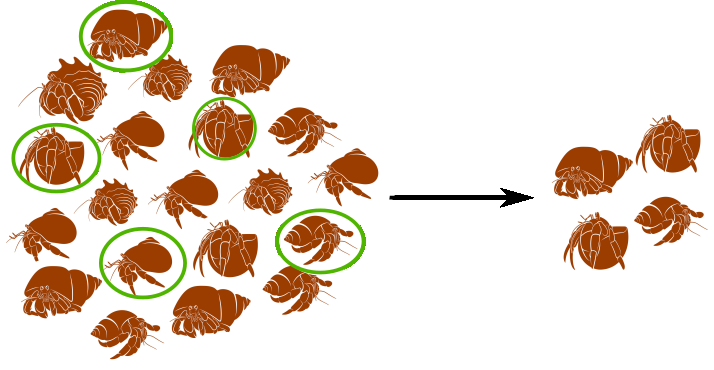
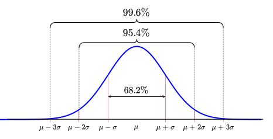

```{r setup, include = FALSE, cache = FALSE, purl = FALSE}
library(knitr)
library(ggplot2)
library(gridExtra)
library(cowplot)

opts_chunk$set(tidy = FALSE, fig.width = 7, fig.height = 3, warning = FALSE, message = FALSE, echo = TRUE)


```

## ЧАСТЬ 1. Характеризуем первичные данные {.center .middle .inverse}


## С какими данными мы работаем

::: {.columns}
::: {.column width="45%"}
**Генеральная совокупность**
:::
::: {.column width="45%"}
**Выборка**
:::
:::



::: {.columns}
::: {.column style="font-size: 0.8em;" }
Характеризуется **Параметрами статистического распределения**
:::
::: {.column style="font-size: 0.8em;"}
Характеризуется **Описательными статистиками**
:::
:::


## Какие бывают данные {.smaller}

::: {.columns}
::: {.column width="28%"}
**Категориальные данные**

орёл или решка

цвет радуги
:::

::: {.column width="28%"}
**Числовые дискретные (счётные)**

оценка за экзамен

количество пластиковых пипеток в упаковке
:::

::: {.column width="28%"}
**Числовые непрерывные (мерные)**

температура воздуха

рост
:::

:::


## Характеризуем данные через связки описательных статистик

::: {.columns}
::: {.column width="50%"}
### Центральные тенденции <br/>(Statistics of location)

- Медиана (Median)

- Среднее значение (Mean)
:::
::: {.column width="50%"}
### Меры разброса <br/>(Statistics of dispersion)

- Квантили (Quantiles)

- Дисперсия (Variance)

- Стандартное отклонение (Standard Deviation)
:::
:::


## ЧАСТЬ 2. Медиана и квантили {.center .middle .inverse}

## Медиана

Предположим, мы занимаемся селекцией яблонь и хотим охарактеризовать урожай любимой яблони, на которую возлагаем большие надежды.

```{r}
apples <- c(7.3, 9.7, 10.1,  9.5,  8.0,  9.2,  7.9,  9.1)
```

## Медиана

Наши данные в исходном виде выглядят примерно так:

```{r}
apples
```


Чтобы увидеть медиану, мы должны ранжировать, наш вектор по возрастанию:

```{r}
sort(apples)
```


## Медиана {.smaller}

В ранжированном ряду медиана расположена так, что слева и справа от нее находится равное число измерений.

- Если *n* нечетное, то медиана = значение с индексом $\frac{n+1}{2}$.
- Если *n* четное, то медиана посередине между $\frac{n}{2}$ и $\frac{n+1}{2}$ значениями.

```{r}
sort(apples)
```

Медиана находится в промежутке между значениями 9.1 и 9.2, т.е. 9.15


```{r}
median(apples) # Проверим себя
```


## Медиана устойчива к выбросам

Представим, что наши измерения пострадали от неаккуратности. Допустим сотрудник, которому мы поручили измерять яблоки, измерил также арбуз и записал этот результат вместе со всеми остальными.

```{r}
apples2 <- c(apples, 68) # Создадим вектор с новым значением
sort(apples2)
```

<br>
Что станет с медианой? Сильно ли она изменится?


::: {.columns}
::: {.column width="50%"}
Было

```{r}
median(apples)
```
:::

::: {.column width="50%"}
Стало

```{r}
median(apples2)
```
:::
:::


## Медиана устойчива к выбросам, а среднее - нет

Давайте для сравнения посмотрим на среднее.

::: {.columns}
::: {.column width="50%"}
Было 

```{r}
mean(apples)
```

:::

::: {.column width="50%"}
Стало 

```{r}
mean(apples2)
```
:::
:::


<br>
Единственное наблюдение-выброс сильно повлияет на величину среднего значения.


## Квантили

Квантили --- это значения, которые делят ряд наблюдений на равные части.

Они называются по-разному в зависимости от числа частей.

Примеры квантилей:

- 2-квантиль ("два-квантиль") --- *медиана*;
- 4-квантиль ("четыре-квантиль")--- *квартиль*;
- 100-квантиль ("сто-квантиль")--- *перцентиль*;


## Квартили

Квартиль --- частный случай квантиля.

Квартили делят распределение на __четыре__ равные части, каждая из которых включает по 25% значений.

- I квартиль отсекает 25%.
- II квартиль --- 50%. Это медиана.
- III квартиль отсекает 75% значений.

Квартили можно найти при помощи функции `quantile()`

```{r echo=TRUE}
quantile(x = apples, probs = c(0.25, 0.5, 0.75))
```


## 5-number summary

Функция `quantile(x)` без указания значений вероятностей (`probs`) покажет нам квартили, минимум и максимум.

```{r}
quantile(apples)
```

5-number summary --- удобное краткое описание данных.


## Персентили

*Персентиль* --- это частный случай квантиля. Всего 99 персентилей, они делят ряд наблюдений на 100 частей.

<br>
Ничто не помешает нам узнать, например, какие значения отсекают 10% или 99% значений выборки. Подставим соответствующие аргументы:

```{r echo=TRUE}
quantile(apples, probs = c(0.1, 0.99))
```


## Боксплот: 5-number summary на графике{.smaller}

::: {.columns}
::: {.column width="50%"}

```{r boxplot.plain.1, fig.height = 5, fig.width = 4, purl=FALSE, echo=2}
op <- par(mar = c(0, 2, 0, 0))
boxplot(apples)
par(op)
```
:::
::: {.column width="50%"}
Отложим числа, характеризующие выборку, по оси Y:

- жирная линия --- медиана,
- нижняя и верхняя границы "коробки" --- это I и III квантили,
- усы --- минимум и максимум.
:::
:::


## Подготовим все, чтобы построить график в ggplot2

```{r echo=TRUE}
library(ggplot2)
theme_set(theme_bw())

apple_data <- data.frame(diameter = apples)
head(apple_data)
```

## Боксплот можно построить при помощи `geom_boxplot()` {.smaller}

::: {.columns}
::: {.column width="60%"}

```{r eval = FALSE}
ggplot(data = apple_data) + 
  geom_boxplot(aes(y = diameter))
```

- `x` --- категория (переменная или текстовое обозначение)
- `y` --- зависимая переменная

Расстояние между I и III квартилями (высота "коробки") называется _интерквартильное расстояние_ (*IQR*)

Усы в `ggplot2` отражают 1.5 *IQR*

:::

::: {.column width="40%"}

```{r echo=FALSE, fig.align='center', fig.height=8}

ggplot(data = apple_data) + 
  geom_boxplot(aes(y = diameter))
```

:::
:::


## Выбросы (Outliers)

::: {.columns}
::: {.column width="60%"}

Если в выборке есть выбросы (значения, отстоящие от границ "коробки" больше чем на 1.5 интерквартильных расстояния), то они будут изображены отдельными точками.

:::

::: {.column width="40%"}

```{r echo=FALSE, fig.align='center', fig.height=8}

apple_data2 <-  data.frame(diameter = c(apples, 13))

ggplot(data = apple_data2) +
  geom_boxplot(aes(y = diameter ))

```

:::
:::


# Case study: диатомовые водоросли в желудках фильтраторов


## Самостоятельная работа {.smaller}

::: {.columns}
::: {.column width="50%"}
В морских сообществах встречаются два вида фильтраторов, один из которых любит селиться прямо на поверхности тела другого.

*Tegella armifera* --- это вид-хозяин. Он может жить как сам по себе, так и вместе с симбионтом.

*Loxosomella nordgardi* --- вид-симбионт. Он практически никогда не встречается в одиночестве.

<br />

Данные: Юта Тамберг

:::
::: {.column width="50%"}


:::
:::


## Case study: диатомовые водоросли в желудках фильтраторов {.smaller}

В файле `diatome_count.csv` дано количество диатомовых водорослей в желудках этих животных. Прочитаем эти данные и посмотрим на них:

```{r}
diatoms <- read.table("data/diatome_count.csv", 
                      header = TRUE, sep = "\t")
```

В таблице 2 переменные:

- `sp` --- вид,
- `count` --- число водорослей в желудке.

В переменной `sp` есть три варианта значений:

- "host_free" --- хозяин без симбионта,
- "host_symbiont" --- хозяин с симбионтом,
- "symbiont" --- симбионт.


## Все ли правильно открылось?

Смотрим первые несколько строк:

```{r}
head(diatoms)
```

Смотрим структуру:

```{r}
str(diatoms)
```


## Есть ли пропущенные значения?

```{r}
sum(! complete.cases(diatoms))
```

Что это за случаи?

```{r}
diatoms[!complete.cases(diatoms), ]
```


## Задание 1

```{r echo=FALSE, purl=FALSE}
head(diatoms)
```

Ваша задача рассчитать 5-number summary для количества диатомовых в желудках хозяев и симбионтов (всех трех категорий).


## Решение

```{r boxplot.plain.diatoms, purl=FALSE, fig.height = 3}
# 5-number summary для хозяев без симбионтов
host_f <- diatoms$count[diatoms$sp == "host_free"]
quantile(host_f, na.rm = TRUE)

# Для хозяев с симбионтами
host_s <- diatoms$count [diatoms$sp == "host_symbiont"]
quantile(host_s, na.rm = TRUE)

# Для одиноких симбионтов
symbiont <- diatoms$count [diatoms$sp == "symbiont"]
quantile(symbiont, na.rm = TRUE)
```


## Решение (более сложный, но краткий способ) {.smaller}

`tapply()` --- одна из функций семейства `*pply()`.

### split --- apply --- combine

Функция `tapply()` берет вектор `X` и...

- делит (split) его на части по значениям в векторе `INDEX`
- применяет (apply) к каждой части функцию `FUN`
- соединяет (combine) результаты в одно целое в зависимости от их свойств

```{r}
tapply(X = diatoms$count, INDEX = diatoms$sp, FUN = quantile, na.rm = TRUE)
```


## Современный способ

Конвейерная обработка данных

```{r}
library(dplyr)

diatoms %>%
  group_by(sp) %>%
  summarise(
    Min_q0    = quantile(count, probs = 0,    na.rm = TRUE),
    q25   = quantile(count, probs = 0.25, na.rm = TRUE),
    q50   = quantile(count, probs = 0.50, na.rm = TRUE),
    q75   = quantile(count, probs = 0.75, na.rm = TRUE),
    Max_q100  = quantile(count, probs = 1,    na.rm = TRUE)
  )

```


## Еще более рациональный способ (dplyr версии ≥ 1.1.0) {.smaller}

::: {.columns}
::: {.column width="50%"}

```{r}
library(dplyr)
library(tidyr)

diatoms %>%
  group_by(sp) %>%
  reframe(
    quantile = names(quantile(count, na.rm = TRUE)),
    value    = quantile(count, na.rm = TRUE)
  )

```

:::

::: {.column width="50%"}

Обратите внимание, что на выходе получаем "длинный" формат.

:::
:::


## Переводим в широкий формат


```{r}
library(dplyr)
library(tidyr)

diatoms %>%
  group_by(sp) %>%
  reframe(
    quantile = names(quantile(count, na.rm = TRUE)),
    value    = quantile(count, na.rm = TRUE)
  ) %>%
  pivot_wider(
    names_from  = quantile,
    values_from = value
  )
```


## Боксплоты в ggplot2

Формат данных несколько сложен для человеческого глаза, зато очень подходит для ggplot.

```{r boxplot.ggplot.diatoms, fig.height = 4.5}
ggplot(data = diatoms, aes(y = count, x = sp)) + geom_boxplot()
```


## Медиана и квартили: непараметрические характеристики выборки {.smaller}


- Главный плюс (но так же и минус) связки медиана + квартили это ее независимость от формы распределения.

- Будь оно симметричным или с хвостом, 5-number summary опишет, а боксплот нарисует его с минимумом искажений.

- Но бывают случаи, когда приходится применять более специальные, но и более информативные характеристики.


## ЧАСТЬ 3. Нормальное распределение - первое знакомство {.center .middle .inverse}


## Все распределения равны, но некоторые равнее {.smaller}

Это непрерывное распределение, получаемое из мерных данных. Однако, многие распределения других типов тоже могут приближаться к нормальному.

```{r ND.1, echo=FALSE, purl=FALSE, fig.width=5.5, fig.height = 5, warning=FALSE, fig.align='center'}
library (ggplot2)
theme_set(theme_bw(base_size = 14))
Mu <- 10
Sigma <- 2
x <- seq(from = 0, to = 20, by = 0.1)
y <- dnorm(x = x, mean = Mu, sd = Sigma)
Norm <- data.frame(x, y)
ND_curve <- ggplot(data = Norm, aes(x=x, y=y)) +
  geom_line(color="steelblue", size=2) + 
#  geom_vline (xintercept = Mu) + 
  labs(x = "Values", y = "Probability density")
ND_hist <- ggplot(data = Norm, aes(x=x, y=y)) +
  geom_bar(stat = "identity", width = .05) +
#  geom_vline (xintercept = Mu) + 
  labs(x = "Values", y = "Relative frequency")
ND_curve
```

**Внимание!** Далеко не все типы данных могут быть описаны с помощью модели нормального распределения.

## Относительная частота и плотность вероятности {.smaller}

::: {.columns}
::: {.column width="40%"}

```{r ND.2, echo=FALSE, purl=FALSE, fig.width=4, fig.height = 6, warning=FALSE}
ND_curve2 <- ND_curve + geom_vline(xintercept = 12, linetype="dotted", color = "red") + geom_vline(xintercept = 14, linetype="dotted", color = "red")
ND_hist2 <- ND_hist + geom_vline(xintercept = 12, linetype="dotted", color = "red") + geom_vline(xintercept = 14, linetype="dotted", color = "red")

grid.arrange(ND_hist2, ND_curve2, ncol = 1)
```

:::
::: {.column width="60%"}
На оси Y может быть отложена относительная частота значений Х в эмпирическом распределении, или вероятность из теоретического распределения.

На оси Х отложены значения Х в интервале от 0 до 20, в действительности же кривая простирается от $-\infty$ до $+\infty$

Площадь под кривой = 1.  Интегрируя кривую на промежутке $(k,..,l)$, можно узнать вероятность встречи значений в этом промежутке $(x_k,...x_l)$.

Но нельзя рассчитать вероятность одного значения $X = x_k$, так как это точка, и под ней нет площади.
:::
:::

---

## Приятные особенности нормального распределения {.smaller}

::: {.columns}
::: {.column width="60%"}

Нормальных кривых бесконечно много, и их описывает формула всего с двумя  параметрами $\mu$ и $\sigma$.

$$f(x) = \frac {1}{\sigma \sqrt{2 \pi}}\, e^{-\cfrac{(x-\mu)^2}{2\sigma^2}}$$

- $\mu$ --- среднее,
- $\sigma$ --- стандартное отклонение.

:::

::: {.column width="40%"}


```{r echo=FALSE}
#| fig-width: 15
#| fig-align: center

include_graphics("images/Gauss.png")
```

<!--  -->

:::
:::


Достаточно знать значения этих двух параметров, чтобы восстановить или *смоделировать* любое нормальное распределение. И наоборот, если данные в выборке распределены нормально, то мы можем оценить параметры этого распределения.


## ЧАСТЬ 4. Среднее и стандартное отклонение {.center .middle .inverse}


## Центральная тенденция

### Среднее арифметическое

$$\bar{x}=\frac{\sum{x_i}}{n}$$

Рассчитаем вручную и проверим:

```{r}
sum(apples) / length(apples)

mean(apples)
```

---

## Как оценить разброс значений?


::: {.columns}
::: {.column width="50%"}

### Девиата (отклонение)

--- это разность между значением вариаты (измерения) и средним:

$$x_i - \bar{x}$$

```{r}
raw_deviates <- apples - mean(apples)
raw_deviates
```

:::

::: {.column width="50%"}
 
```{r echo=FALSE, fig.height=8}
ind <- seq(1,8,1)
app2 <- sort(apples)
app <- data.frame(apples, app2, ind)

pl_app1 <- ggplot(app, aes(x = ind, y = apples)) + 
  geom_point() + 
  xlab("Порядковый номер\nнаблюдения\n(индекс)") + 
  ylab("Диаметр яблока") + 
  geom_hline(yintercept = mean(apples), linewidth = 1.2,  color = "steelblue") +
  geom_segment(aes(x = ind, y = apples, xend = ind, yend = mean(apples))) +
  scale_x_continuous(breaks = 1:10)
pl_app1 + coord_flip()
```

:::
:::


---

## Меры разброса {.smaller}

### Девиаты не годятся как мера разброса

К сожалению мы не можем просто сложить все значения девиат и поделить их на объем выборки. Сумма девиат всегда будет равна нулю.

```{r}
round(sum(raw_deviates))
```

$$\begin{aligned}
\sum{(x_i - \bar{x})} &= \sum x_i - \sum \bar x = \\
&= \sum x_i - n \bar x = \\
&= \sum x_i - n \cfrac{\sum x_i}{n} = 0
\end{aligned}$$

---

## Меры разброса

### Сумма квадратов = SS, Sum of Squares

Избавиться от знака девиаты можно, возведя значение в квадрат.

$$SS = \sum{{(x_i - \bar{x})}^2} \ne 0$$

```{r results="hide"}
sum(raw_deviates^2)
```

Но на что разделить $SS$, чтобы получить меру __усредненного__ отклонения значений от среднего?


## Меры разброса {.smaller}

### Как усреднить отклонения от среднего значения?

Мы не можем делить на $n$, поскольку отклонения от среднего  $x_i - \bar x$ не будут независимы.

Что это значит? Сумма отклонений всегда равна нулю $\sum{(x_i - \bar{x})} = 0$.  
Поэтому, если мы знаем $\bar x$ и $n - 1$ отклонений, то всегда сможем точно вычислить последнее отклонение.

<br />

$n - 1$ --- это число независимых значений (число степеней свободы --- __degrees of freedom__).


## Более строгое объяснение

Мы хотим охарактеризовать парметр $\sigma^2$ через $\sum (x_i - \bar{x})^2$

тогда

$$
E\left[\frac{\sum (x_i - \bar{x})^2}{n}\right] = \sigma^2 \cdot \frac{n-1}{n}
$$

Получаем смещенную оценку

## Несмещенная оценка

$$
E\left[\frac{SS}{n-1}\right] = \frac{\sigma^2 (n-1)}{n-1} = \sigma^2
$$

Поэтому при усреднении $SS$ нам надо делить на $n-1$

$$
\frac{SS}{n} \cdot \frac{n}{n-1} = \frac{SS}{n-1}
$$


## Меры разброса

### Дисперсия = MS, Mean Square, Variance

Если мы теперь поделим сумму квадратов на объем выборки минус 1, то получим дисперсию по этой выборке.

$$s^2=\frac{\sum{(x_i - \bar{x})^2}}{n - 1}= \frac{SS}{n - 1}$$

```{r results="hide"}
sum(raw_deviates^2) / (length(apples) - 1)
var(apples)
```


Дисперсию не получится нарисовать на графике, т.к. там используются не отклонения, а их квадраты


## Меры разброса {.smaller}

### Среднеквадратичное/стандартное отклонение = Standard Deviation

Квадратный корень из дисперсии позволит вернуться к исходным единицам измерения

$$s = \sqrt{s^2} = \sqrt{\frac{\sum{(x_i - \bar{x})^2}}{n - 1}} = SD$$

Стандартное отклонение --- это средняя величина отклонения, и ее уже можно изобразить на графике.

```{r results="hide"}
sqrt(sum(raw_deviates^2) / (length(apples) - 1))
sd(apples)
```


## Среднее и стандартное отклонение при помощи `stat_summary()` {.smaller}

::: {.columns}
::: {.column width="33%"}
`stat_summary()` использует `geom_pointrange()`  
точка --- среднее, усы изображают $\pm$ стандартное отклонение

`mean_sdl()` рассчитывает координаты точки и усов,  ее аргумент `mult = 1` показывает, сколько стандартных отклонений отложить
:::
::: {.column width="66%"}
```{r}
ggplot(data = apple_data) + 
  stat_summary(geom = 'pointrange', fun.data = mean_sdl, 
               fun.args = list(mult = 1),
               aes(x = 'Среднее \nи стандартное отклонение', 
                   y = diameter))
```
:::
:::

---

## Особенности применения связки mean-sd

- только вместе,

- чувствительны к выбросам,

- плохо работают с несимметричными распределениями.

---

## Сравните разброс (стандартное отклонение) в выборках

```{r sd_compare1, echo=FALSE, purl=FALSE, fig.width=9, fig.height = 6, warning=FALSE, message=FALSE}
set.seed(999)
y1 <- rnorm(500, 10, 4)
y2 <- rnorm(500, 10, 1)
y3 <- rnorm(500, 10, 0.01)
y4 <- runif(500, -1, 21)
y5 <- 2 * rf(500, 5, 5)
y6 <- c(rnorm(250, mean = 1, sd = 0.1), rnorm(250, 19, 0.1))

sd_compare <- data.frame(y1, y2, y3, y4, y5, y6)

gy1 <- ggplot(sd_compare, aes(x = y1)) + geom_histogram(fill = "steelblue", color = "grey20") +  geom_vline (xintercept = 10, color = "red", linetype = "dashed", size = 1.5) + scale_x_continuous(limits = c(0,20)) + labs(x = "Distribution 1")

gy2 <- ggplot(sd_compare, aes(x = y2)) + geom_histogram(fill = "steelblue", color = "grey20") +  geom_vline (xintercept = 10, color = "red", linetype = "dashed", size = 1.5) + scale_x_continuous(limits = c(0,20))  + labs(x = "Distribution 2")

gy3 <- ggplot(sd_compare, aes(x = y3)) + geom_histogram(fill = "steelblue", color = "grey20") +  geom_vline (xintercept = 10, color = "red", linetype = "dashed", size = 1.5) + scale_x_continuous(limits = c(0,20))  + labs(x = "Distribution 3")

gy4 <- ggplot(sd_compare, aes(x = y4)) + geom_histogram(fill = "steelblue", color = "grey20") +  geom_vline (xintercept = 10, color = "red", linetype = "dashed", size = 1.5) + scale_x_continuous(limits = c(0,20))  + labs(x = "Distribution 4")

gy5 <- ggplot(sd_compare, aes(x = y5)) + geom_histogram(fill = "steelblue", color = "grey20") +  geom_vline (xintercept = mean(y5), color = "red", linetype = "dashed", size = 1.5) + scale_x_continuous(limits = c(0,20))  + labs(x = "Distribution 5")

gy6 <- ggplot(sd_compare, aes(x = y6)) + geom_histogram(fill = "steelblue", color = "grey20") +  geom_vline (xintercept = 10, color = "red", linetype = "dashed", size = 1.5) + scale_x_continuous(limits = c(0,20))  + labs(x = "Distribution 6")

grid.arrange(arrangeGrob(gy1, gy2, gy3, ncol = 1), arrangeGrob(gy4, gy5, gy6, ncol = 1), ncol = 2)
```

---

## Проверим себя

```{r sd_compare2, echo=FALSE, purl=FALSE, fig.width=9, fig.height = 6, warning=FALSE, message=FALSE}

gy1a <- gy1 + labs(x = round(sd(y1), 1))

gy2a <- gy2  + labs(x = round(sd(y2), 1))

gy3a <- gy3  + labs(x = round(sd(y3), 2))

gy4a <- gy4  + labs(x = round(sd(y4), 1))

gy5a <- gy5  + labs(x = round(sd(y5), 1))

gy6a <- gy6  + labs(x = round(sd(y6), 1))

grid.arrange(arrangeGrob(gy1a, gy2a, gy3a, ncol = 1), arrangeGrob(gy4a, gy5a, gy6a, ncol = 1), ncol = 2)
```

<!-- --- -->

<!-- ## Задание 2 -->

<!-- Из 5 положительных чисел создайте выборку со средним = 10 и медианой = 7 -->

<!-- --- -->

<!-- ## Решение -->

<!-- В выборке с медианой = 7 и n = 5, мы точно знаем: __(а)__ одно из значений должно быть равно 7, __(б)__ два значения должны быть меньше, и два --- больше 7. -->

<!-- Создадим вектор, в котором одно значение задано, а три других просто придумаем: -->

<!-- ```{r purl=FALSE} -->
<!-- example <- c(2, 5, 7, 10) -->
<!-- ``` -->

<!-- Среднее это сумма всех значений выборки, поделенная на ее объем. Умножив среднее на 5 получим сумму всех значений. -->

<!-- Определим недостающее и проверим себя: -->

<!-- ```{r purl=FALSE} -->
<!-- 10 * 5 - sum(example) -->
<!-- example <- c(2, 5, 7, 10, 26) #перезапишем вектор -->
<!-- mean(example) -->
<!-- ``` -->

<!-- --- -->

## Как соотносятся разные способы оценки центральной тенденции и размаха в выборке?

```{r}
ggplot(data = apple_data) + 
  geom_boxplot(aes(x = 'Медиана \nи квантили', y = apples)) +
  stat_summary(geom = 'pointrange', fun.data = mean_sdl, 
               fun.args = list(mult = 1), 
               aes(x = 'Среднее \nи стандартное отклонение', y = diameter))
```

Медиана и среднее дают сходные результаты, если выборка не содержит выбросов (сильно отличающихся от других наблюдений).


## ЧАСТЬ 5. Свойства нормального распределения {.center .middle .inverse}

---

## Нормальное распределение {.smaller}

::: {.columns}
::: {.column width="66%"}
```{r g-norm, echo=FALSE, purl=FALSE}
library(cowplot)
library(ggplot2)
theme_set(theme_bw())
ND_curve <- ggplot(data = data.frame(x = 0:20), aes(x = x)) +
  stat_function(fun = dnorm, args = list(mean = 10, sd = 2), 
                colour = 'red3', size = 1) +
  labs(y = 'Плотность вероятности')
ND_curve
```
:::
::: {.column width="33%"}
- симметричное 
- унимодальное
- непрерывное


:::
:::

::: {.column width="66%"}

$$f(x) = \cfrac {1}{\sigma \sqrt{2 \pi}} \; e^{- \: \cfrac{(x-\mu)^2}{2\sigma^2}}$$
- $\mu$ --- среднее значение     
- $\sigma$ --- стандартное отклонение     
- Это кратко записывается как $x \sim N(\mu, \sigma)$.     
:::

---

## Вероятности --- это площади под кривой распределения

```{r g-norm-interval, echo=FALSE, purl=FALSE}
ND_curve + 
    stat_function(geom = 'area', fun = dnorm, args = list(mean = 10, sd = 2), 
                  xlim = c(11, 14), alpha = 0.6, fill = 'red3')
```

$-\infty < x < +\infty$.

Площадь под всей кривой $= 1$.

Вероятность встречи значений из определенного промежутка можно узнать, проинтегрировав функцию распределения.

---

## Эмпирическое правило нормального распределения

::: {.center}

:::

- 68% значений находятся в пределах 1 стандартного отклонения $\sigma$
- 95% значений --- в пределах 2 $\sigma$
- 99.7% значений --- в пределах 3 $\sigma$

---

## Стандартное нормальное распределение

```{r echo=FALSE, purl=FALSE}
ggplot(data = data.frame(x = -3.5:3.5), aes(x = x)) +
  stat_function(fun = dnorm, args = list(mean = 0, sd = 1), 
                colour = 'red3', size = 1) +
  scale_x_continuous(breaks = -3:3) +
  labs(x = 'z', y = 'Плотность вероятности')
```

$$N(0, 1)$$

---

## Стандартизация (Z-преобразование)

::: {.columns}
::: {.column width="50%"}
```{r echo=FALSE, purl=FALSE, fig.width = 8, fig.height=10}
gg_sample <- ggplot(data = data.frame(x = 0:20), aes(x = x)) +
  stat_function(fun = dnorm, args = list(mean = 10, sd = 2), 
                colour = 'steelblue', size = 1) +
    theme(axis.text = element_text(size = 20),
        axis.title = element_text(size = 20)) +
    labs(y = ' ')

gg_z <- ggplot(data = data.frame(x = -5:5), aes(x = x)) +
  stat_function(fun = dnorm, args = list(mean = 0, sd = 1), 
                colour = 'red3', size = 1) +
  scale_x_continuous(breaks = -5:5) +
  theme(axis.text = element_text(size = 20),
        axis.title = element_text(size = 20)) +
  labs(x = 'z', y = ' ', size = 20)

gg_sample_z <- plot_grid(gg_sample, gg_z, ncol = 1, align = 'v')
ggdraw(gg_sample_z) + 
  draw_label('Плотность вероятности', angle = 90, x = 0.015, y = 0.5, size = 20, fontfamily = 'GT Eesti Pro Display')
```
:::
::: {.column width="50%"}
$$z = \frac{x - \mu}{\sigma}$$

После стандартизации любое нормальное распределение превращается в стандартное нормальное:

$$Z \sim N(0, 1)$$
:::
:::


## Задание 1

Стандартизуйте вектор `1:5`

Чему после стандартизации будет равно среднее?

Стандартное отклонение?


## Стандартизация {.smaller}

::: {.columns}
::: {.column width="50%"}
```{r echo=FALSE, purl=FALSE}
set.seed(4122113)

Xi <- round(rnorm(n = 10, mean = 10, sd = 2), 0)
Mu <- mean(Xi)
Sd <- sd(Xi)
Zi <- (Xi - Mu) / Sd
Z <- data.frame(Xi, Zi)

lab_sample <- substitute(paste('До стандартизации', ~bar(x)==Mu, ',  ', s==Sd),
                         list(Mu = format(Mu, digits = 1, nsmall = 0), 
                              Sd = format(Sd, digits = 1, nsmall = 2)))
lab_z <- expression(paste('После стандартизации', ~bar(z)==0, ',  ', s[z]==1))

gg_sample <- ggplot(data = Z, aes(x = Xi)) + 
  geom_dotplot(fill = 'green4') +
  scale_x_continuous(breaks = seq(0, 20, 1)) +
  geom_vline(xintercept = mean(Xi), 
             colour = 'steelblue') +
  geom_vline(xintercept = mean(Xi) + sd(Xi) * c(-1, 1), 
             colour = 'steelblue', linetype = 'dashed') + 
  labs(title = lab_sample, x = 'x') +
  theme(text = element_text(size = 20))
  

gg_z <- ggplot(data = Z, aes(x = Zi)) + 
  geom_dotplot(fill = 'red3') +
  geom_vline(xintercept = mean(Zi), 
             colour = 'red3') +
  geom_vline(xintercept = mean(Zi) + sd(Zi) * c(-1, 1), 
             colour = 'red3', linetype = 'dashed') +
  labs(title = lab_z, x = 'z') +
  theme(text = element_text(size = 20))
  
    

plot_grid(gg_sample + theme_void(),
          gg_z + theme_void(), 
          ncol = 1)
```
:::
::: {.column width="50%"}
$$z_i=\frac{x_i - \bar{x}}{s}$$

Стандартизованная величина (Z-оценка) показывает, на сколько стандартных отклонений значение отличается от среднего

**После стандартизации всегда**:

- среднее $\bar{z} = 0$
- стандартное отклонение $s_{z} = 1$
:::
:::

---


## Стандартизация позволяет уравнять шкалы, в которых измерены переменные

```{r echo=FALSE, purl=FALSE, fig.width = 10, fig.height=7}
library(dplyr)
library(tidyr)
data('birthwt', package = 'MASS')
gg_unscaled <- birthwt %>% 
  dplyr::select(age, bwt) %>% 
  gather(variable, value) %>% 
  ggplot(aes(x = variable, y = value)) + 
  geom_hline(yintercept = 0, colour = 'darkgrey') +
  geom_boxplot(fill = 'green4', width = 0.2) +
  labs(title = 'До стандартизации') + 
  theme(text = element_text(size = 18))

gg_scaled <- birthwt %>% 
  dplyr::select(age, bwt) %>% 
  scale() %>% data.frame() %>% 
  gather(variable, value) %>%
  ggplot(aes(x = variable, y = value)) + 
  geom_hline(yintercept = 0, colour = 'darkgrey') +
  geom_boxplot(fill = 'red3', width = 0.2) +
  labs(title = 'После стандартизации') + 
  theme(text = element_text(size = 18))

plot_grid(gg_unscaled, gg_scaled, ncol = 2)
```


## Зачем нужна стандартизация?

- Стандартизация приводит данные к безразмерной шкале, где всё измеряется в «стандартных отклонениях».

- Это позволяет строить однотипный анализ для разнородных данных.


---

## ЧАСТЬ 6. Проверка на нормальность {.center .middle .inverse}

---

## Квантильный график {.smaller}

По оси $X$ отложены квантили стандартного нормального распределения, по оси $Y$ --- квантили исходных данных. 

Если $x \sim N(\mu,\sigma)$, то квантили стандартизованного распределения будут подобны квантилям распределения "сырых" данных и точки лягут на прямую линию.

```{r echo=FALSE, purl=FALSE, fig.height=6}
library(car)
set.seed(9109)
x <- rnorm(n = 100, mean = 10, sd = 3)
par(mfrow = c(1, 2))
hist(x, nclass = 30, main = "")
qqPlot(x, id = FALSE)
par(mfrow = c(1, 1))
```

---

## Квантильный график в `R`

```{r fig.width=4, fig.height=6}
set.seed(9128)
my_vector <- rnorm(n = 150, mean = 10, sd = 3)
library(car)
qqPlot(my_vector, id = FALSE) # квантильный график
```

---

## Задание 2

Выполните по одному блоки кода (см. код к этой презентации).

Что вы можете сказать о свойствах распределений, изображенных на квантильных графиках?

---

## Бимодальное (двувершинное) распределение

```{r echo=FALSE, fig.height=7, fig.width=12}
library(car)
set.seed(3287447)
x <-c(rnorm(n = 75, mean = 10, sd = 4), rnorm(n = 75, mean = 30, sd = 6))
par(mfrow = c(1, 2))
hist(x, nclass = 30, main = '')
qqPlot(x, id = FALSE)
par(mfrow = c(1, 1))
```

---

## Дискретное распределение с длинным правым хвостом

```{r echo=FALSE, fig.height=7, fig.width=12}
set.seed(8921)
x <- rpois(n = 100, lambda = 4)
par(mfrow = c(1, 2))
hist(x , nclass = 30, main = '')
qqPlot(x, id = FALSE)
par(mfrow = c(1, 1))
```

---

## Непрерывное распределение с толстыми хвостами

```{r echo=FALSE, fig.height=7, fig.width=12}
set.seed(49199158)
x <- rt(n = 150, df = 6)
par(mfrow = c(1, 2))
hist(x , nclass = 30, main = '')
qqPlot(x, id = FALSE)
par(mfrow = c(1, 1))
```

---

## Непрерывное распределение с длинным правым хвостом

```{r echo=FALSE, fig.height=7, fig.width=12}
set.seed(1298)
x <- rchisq(n = 150, df = 1)
par(mfrow = c(1, 2))
hist(x, nclass = 30, main = '')
qqPlot(x, id = FALSE)
par(mfrow = c(1, 1))
```

<!-- Если интересны подробности, можно посмотреть симуляции, например, здесь https://stats.stackexchange.com/questions/101274/how-to-interpret-a-qq-plot -->

---

## Задание 3

Проверьте при помощи квантильного графика, подчиняются ли эти переменные нормальному распределению:

- Рост американских женщин (датасет `women`)
- Длина чашелистиков у ирисов (датасет `iris`)
- Число пойманных рысей в Канаде с 1821 по 1934г. (датасет `lynx`)

---

## Решение (3.1)

```{r}
data("women")
str(women)
qqPlot(women$height, id = FALSE)
```

---

## Решение (3.2)

```{r}
data("iris")
str(iris)
op <- par(mfrow = c(1, 2))
qqPlot(iris$Sepal.Length, id = FALSE)
hist(iris$Sepal.Length)
par(op)
```

---

## Решение (3.3)

```{r}
data("lynx")
str(lynx)
op <- par(mfrow = c(1, 2))
qqPlot(lynx, id = FALSE)
hist(lynx)
par(op)
```

---

## ЧАСТЬ 7. Оценка вероятностей при помощи распределений {.center .middle .inverse}

---

## Кривые распределений можно использовать для оценки вероятностей

```{r purl=FALSE, echo=FALSE, fig.height=5, fig.width=12}
mu <- 0; sig <- 1; X1 <- -2; X2 <- 2
dfr <- data.frame(z = seq(-4, 4, length.out = 1000))

gg_part <- ggplot(dfr, aes(x = z)) +
  scale_x_continuous(name = 'z', breaks = -3:3) +
  labs(y = 'Плотность вероятности') +
  geom_vline(xintercept = c(-0.5, 1.25), linetype = 'dashed', colour = 'red') +
  stat_function(geom = 'area', fun = dnorm, args = list(mean = mu, sd = sig), 
                size = 1, fill = 'red3', alpha = 0.5, xlim = c(-0.5, 1.25)) +
  stat_function(geom = 'line', fun = dnorm, args = list(mean = mu, sd = sig), 
                size = 1, colour = 'red3') +
  theme(text = element_text(size = 18))

gg_part +
annotate(geom = 'text', parse = TRUE,
           x = mu, y = 0.15, 
           label = "P")
```

---

## Площадь под всей кривой распределения равна 1

```{r purl=FALSE, echo=FALSE, fig.height=6, fig.width=12}
mu <- 0; sig <- 1; X1 <- -1.5; X2 <- 1.5
dfr <- data.frame(z = seq(-4, 4, length.out = 1000))

gg_all <- ggplot(dfr, aes(x = z)) +
  scale_x_continuous(name = 'z', breaks = -3:3) +
  labs(y = 'Плотность вероятности') + 
  stat_function(geom = 'area', fun = dnorm, args = list(mean = mu, sd = sig), 
                size = 1, fill = 'red3', alpha = 0.5) +
  stat_function(geom = 'line', fun = dnorm, args = list(mean = mu, sd = sig), 
                size = 1, colour = 'red3')

gg_all +
annotate(geom = 'text', parse = TRUE,
           x = mu, y = 0.15, 
           label = "P[group('(',list(-infinity, infinity),')')] == 1")
```

---

## Вероятность конкретного значения нельзя определить

```{r purl=FALSE, echo=FALSE, fig.height=6, fig.width=12}
gg_X1 <- ggplot(dfr, aes(x = z)) +
  scale_x_continuous(name = 'z', breaks = -3:3) +
  labs(y = 'Плотность вероятности') + 
    stat_function(geom = 'line', fun = dnorm, args = list(mean = mu, sd = sig), 
                  size = 1, colour = 'red3') +
  geom_vline(xintercept = X1, linetype = 'dashed', colour = 'red') +
  annotate('point', x = X1, y = dnorm(X1, mean = mu, sd = sig), 
           colour = 'red3', fill = 'lightblue', shape = 21, size = 3) +
  annotate(geom = 'text', parse = TRUE, 
             x = X1, y = dnorm(X1, mean = mu, sd = sig), 
             label = paste0("P[(x == ", X1, ")] == 0"), 
             hjust = 1.1, size = 6) +
  theme(text = element_text(size = 18))

gg_X1
```

---

## Можно определить вероятность того, что значение будет меньше заданного

```{r purl=FALSE, echo=FALSE, fig.height=5, fig.width=12}
gg_less_X2 <- ggplot(data = dfr, aes(x = z)) +
  geom_vline(xintercept = X2, linetype = 'dashed', colour = 'red') +
  scale_x_continuous(name = 'z', breaks = -3:3) +
  stat_function(fun = dnorm, args = list(mean = mu, sd = sig), 
                colour = 'red3', size = 3) +
  labs(x = 'Значение', y = 'Плотность вероятности') +
  stat_function(geom = 'area', fun = dnorm, args = list(mean = mu, sd = sig), 
                xlim = c(min(dfr$z), X2), alpha = 0.6, fill = 'red3') +
  theme(text = element_text(size = 18))

gg_less_X2 +
    annotate(geom = 'text', parse = TRUE, 
           x = X2, y = dnorm(X2, mean = mu, sd = sig), 
           label = paste0("P[(x <= ", X2, ")]"), 
           hjust = 1.1, size = 5)
```

---

## Остальные площади легко найти при помощи простых арифметических действий с площадями

```{r purl=FALSE, echo=FALSE, fig.height=6, fig.width=12}
gg_greater_X2 <- ggplot(data = dfr, aes(x = z)) +
  geom_vline(xintercept = X2, linetype = 'dashed', colour = 'red') +
  scale_x_continuous(name = 'z', breaks = -3:3) +
  stat_function(fun = dnorm, args = list(mean = mu, sd = sig), 
                colour = 'red3', size = 1) +
  labs(x = 'Значение', y = 'Плотность вероятности') +
  stat_function(geom = 'area', fun = dnorm, args = list(mean = mu, sd = sig), 
                xlim = c(X2, max(dfr$z)), alpha = 0.6, fill = 'red3')

gg_greater <- plot_grid(gg_greater_X2 + theme_void(), 
          gg_all + theme_void(), 
          gg_less_X2 + theme_void(), 
          nrow = 1)

gg_greater <- ggdraw(gg_greater) + 
  draw_label(label = '=', size = 20, x = 0.33, y = 0.5) +
  draw_label(label = '–', size = 20, x = 0.66, y = 0.5)

gg_between_X1X2 <- ggplot(data = dfr, aes(x = z)) +
  geom_vline(xintercept = X1, linetype = 'dashed', colour = 'red') +
  geom_vline(xintercept = X2, linetype = 'dashed', colour = 'red') +
  scale_x_continuous(name = 'z', breaks = -3:3) +
  stat_function(fun = dnorm, args = list(mean = mu, sd = sig), 
                colour = 'red3', size = 1) +
  labs(x = 'Значение', y = 'Плотность вероятности') +
  stat_function(geom = 'area', fun = dnorm, args = list(mean = mu, sd = sig), 
                xlim = c(X1, X2), alpha = 0.6, fill = 'red3')
gg_less_X1 <- ggplot(data = dfr, aes(x = z)) +
  geom_vline(xintercept = X1, linetype = 'dashed', colour = 'red') +
  scale_x_continuous(name = 'z', breaks = -3:3) +
  stat_function(fun = dnorm, args = list(mean = mu, sd = sig), 
                colour = 'red3', size = 1) +
  labs(x = 'Значение', y = 'Плотность вероятности') +
  stat_function(geom = 'area', fun = dnorm, args = list(mean = mu, sd = sig), 
                xlim = c(min(dfr$z), X1), alpha = 0.6, fill = 'red3')

gg_between <- plot_grid(gg_between_X1X2 + theme_void(),
                        gg_less_X2 + theme_void(), 
                        gg_less_X1 + theme_void(), 
                        nrow = 1)

gg_between <- ggdraw(gg_between) + 
  draw_label(label = '=', size = 20, x = 0.33, y = 0.5) +
  draw_label(label = '–', size = 20, x = 0.66, y = 0.5)

plot_grid(gg_greater, gg_between, nrow = 2)
```

---

## Пример: Размеры улиток {.smaller}

В выборке улиток средний диаметр раковины 5 см со стандартным отклонением 1.5 см.

- Какова вероятность того, что случайно выбранная улитка окажется __меньше 3 см__?
- Какова вероятность того, что случайно выбранная улитка окажется __больше 6 см__?
- Какова доля улиток с размером раковины __в пределах 3--6 см__?

```{r echo=FALSE}
#| fig-width: 15
#| fig-align: center

include_graphics("images/tres-caracoles-by-Alberto-Villen-on-freeimages.com.jpg")

```


<!-- {width=200%} -->

<small>tres caracoles by Alberto Villen on Freeimages.com</small>

---

## Вероятность встретить значение меньше заданного {.smaller}

В выборке улиток средний диаметр раковины 5 см со стандартным отклонением 1.5 см.

### Какова вероятность того, что случайно выбранная улитка окажется __меньше 3 см__?

```{r}
Z_1 <- (3 - 5) / 1.5
pnorm(q = Z_1)
# или то же самое
pnorm(q = 3, mean = 5, sd = 1.5)
```

```{r snail-small, purl=FALSE, echo=FALSE, fig.width = 6, fig.height=3}
mu <- 5; sig <- 1.5; X1 <- 3; X2 <- 6
dfr <- data.frame(x = seq(0, 10, length.out = 1000))
dfr$y <- dnorm(dfr$x, mean = mu, sd = sig)
dfr$y[!(dfr$x < X1)] <- NA

ggplot(dfr, aes(x = x)) +
  stat_function(fun = dnorm, args = list(mean = mu, sd = sig), size = 1, geom = "line", colour = "steelblue") +
  scale_x_continuous(name = "Диаметр", breaks = 1:9,
                     sec.axis = sec_axis(~(. - mu)/sig, name = "Z-оценка", breaks = -4:4)) +
  labs(y = "Плотность вероятности") +
  geom_area(aes(x = x, y = y), fill = "steelblue", alpha = 0.5) +
  geom_vline(xintercept = X1, colour = "red3", linetype = "dashed")
```

---

## Вероятность встретить значение больше заданного {.smaller}

В выборке улиток средний диаметр раковины 5 см со стандартным отклонением 1.5 см.

### Какова вероятность того, что случайно выбранная улитка окажется __больше 6 см__?

::: {.columns}
::: {.column width="33%"}
Мы умеем интегрировать только влево от выбранного значения, поэтому

- выясняем вероятность встретить значение меньше заданного $p$
- находим комплементарную вероятность $1 - p$
:::
::: {.column width="66%"}
```{r}
1 - pnorm(q = 6, mean = 5, sd = 1.5)
```

```{r snail-large, purl=FALSE, echo=FALSE, fig.align='center', fig.height=3.8}

dfr <- data.frame(x = seq(0, 10, length.out = 1000))
dfr$y <- dnorm(dfr$x, mean = mu, sd = sig)
dfr$y[!(dfr$x > X2)] <- NA
ggplot(dfr, aes(x = x)) +
  stat_function(fun = dnorm, args = list(mean = mu, sd = sig), size = 1, geom = "line", colour = "steelblue") +
  scale_x_continuous(name = "Диаметр", breaks = 1:8,
                     sec.axis = sec_axis(~(. - mu)/sig, name = "Z-оценка", breaks = -4:4)) +
  labs(y = "Плотность вероятности") +
  geom_area(aes(x = x, y = y), fill = "steelblue", alpha = 0.5) +
  geom_vline(xintercept = X2, colour = "red3", linetype = "dashed")
```
:::
:::

---

## Вероятность встретить значение в заданных пределах {.smaller}

В выборке улиток средний диаметр раковины 5 см со стандартным отклонением 1.5 см.

### Какова доля улиток с размером раковины __в пределах 3--6 см__?

```{r}
pnorm(q = 6, mean = 5, sd = 1.5) - 
  pnorm(q = 3, mean = 5, sd = 1.5)
```

```{r snail-medium, purl=FALSE, echo=FALSE, fig.width = 5, fig.height=3.5}
dfr <- data.frame(x = seq(0, 10, length.out = 1000))
dfr$y <- dnorm(dfr$x, mean = mu, sd = sig)
dfr$y[!(dfr$x > X1 & dfr$x < X2)] <- NA
ggplot(dfr, aes(x = x)) +
  stat_function(fun = dnorm, args = list(mean = mu, sd = sig), size = 1, geom = "line", colour = "steelblue") +
  scale_x_continuous(name = "Диаметр", breaks = 1:9,
                     sec.axis = sec_axis(~(. - mu)/sig, name = "Z-оценка", breaks = -4:4)) +
  labs(y = "Плотность вероятности") +
  geom_area(aes(x = x, y = y), fill = "steelblue", alpha = 0.5) +
  geom_vline(xintercept = X1, colour = "red3", linetype = "dashed") +
  geom_vline(xintercept = X2, colour = "red3", linetype = "dashed")
```

---

## Задание 4

Средний рост 18-летних мужчин в России 174.7 см со стандартным отклонением 6.65 см. В пилоты берут только людей с ростом от 160 до 190 см (по приказу Минтранса).

- Какова вероятность того, что случайно выбранный мужчина окажется __ниже 160 см__?

- Какова вероятность того, что случайно выбранный мужчина окажется  __больше 190 см__?

- Какова доля мужчин, не подходящих по росту в пилоты, т.е. __меньше 160 и больше 190 см__?

---

## Решение (4.1) {.smaller}

Средний рост 18-летних мужчин в России 174.7 см со стандартным отклонением 6.65 см. В пилоты берут только с ростом от 160 до 190 см (по приказу Минтранса).

### Какова вероятность того, что случайно выбранный мужчина окажется __ниже 160 см__?

```{r purl=FALSE}
Z_short <- (160 - 174.7) / 6.65
pnorm(q = Z_short)
# или то же самое
pnorm(q = 160, mean = 174.7, sd = 6.65)
```

```{r men-short, purl=FALSE, echo=FALSE, fig.width = 5, fig.height=2.5}
mu <- 174.7; sig <- 6.65; X1 <- 160; X2 <- 190
dfr <- data.frame(x = seq(150, 200, length.out = 1000))
dfr$y <- dnorm(dfr$x, mean = mu, sd = sig)
dfr$y[!(dfr$x < X1)] <- NA
ggplot(dfr, aes(x = x)) +
  stat_function(fun = dnorm, args = list(mean = mu, sd = sig), size = 1, geom = "line", colour = "steelblue") +
  scale_x_continuous(name = "Рост",
                     sec.axis = sec_axis(~(. - mu)/sig, name = "Z-оценка", breaks = -4:4)) +
  labs(y = "Плотность вероятности") +
  geom_area(aes(x = x, y = y), fill = "steelblue", alpha = 0.5) +
  geom_vline(xintercept = X1, colour = "red3", linetype = "dashed")
```

---

## Решение (4.2) {.smaller}

Средний рост 18-летних мужчин в России 174.7 см со стандартным отклонением 6.65 см. В пилоты берут только с ростом от 160 до 190 см (по приказу Минтранса).

### Какова вероятность того, что случайно выбранный мужчина окажется  __больше 190 см__?

```{r purl=FALSE}
1 - pnorm(q = 190, mean = 174.7, sd = 6.65)
```

```{r men-tall, purl=FALSE, echo=FALSE, fig.width = 6, fig.height=4}
dfr$y <- dnorm(dfr$x, mean = mu, sd = sig)
dfr$y[!(dfr$x > X2)] <- NA
ggplot(dfr, aes(x = x)) +
  stat_function(fun = dnorm, args = list(mean = mu, sd = sig), size = 3, geom = "line", colour = "steelblue") +
  scale_x_continuous(name = "Рост",
                     sec.axis = sec_axis(~(. - mu)/sig, name = "Z-оценка", breaks = -4:4)) +
  labs(y = "Плотность вероятности") +
  geom_area(aes(x = x, y = y), fill = "steelblue", alpha = 0.5) +
  geom_vline(xintercept = X2, colour = "red3", linetype = "dashed") +
  theme(text = element_text(size = 18))
```

---

## Решение (4.3) {.smaller}

Средний рост 18-летних мужчин в России 174.7 см со стандартным отклонением 6.65 см. В пилоты берут только с ростом от 160 до 190 см (по приказу Минтранса).

### Какова доля мужчин, не подходящих по росту в пилоты, т.е. __меньше 160 и больше 190 см__?

```{r purl=FALSE}
(1 - pnorm(q = 190, mean = 174.7, sd = 6.65)) + 
  pnorm(q = 160, mean = 174.7, sd = 6.65)
```

```{r men-not-pilots, purl=FALSE, echo=FALSE, fig.width = 6, fig.height=4}
dfr$y1 <- dnorm(dfr$x, mean = mu, sd = sig)
dfr$y1[!(dfr$x < X1)] <- NA
dfr$y2 <- dnorm(dfr$x, mean = mu, sd = sig)
dfr$y2[!(dfr$x > X2)] <- NA

ggplot(dfr, aes(x = x)) +
  stat_function(fun = dnorm, args = list(mean = mu, sd = sig), size = 2, geom = "line", colour = "steelblue") +
  scale_x_continuous(name = "Рост",
                     sec.axis = sec_axis(~(. - mu)/sig, name = "Z-оценка", breaks = -4:4)) +
  labs(y = "Плотность вероятности") +
  geom_area(aes(x = x, y = y1), fill = "steelblue", alpha = 0.5) +
  geom_area(aes(x = x, y = y2), fill = "steelblue", alpha = 0.5) +
  geom_vline(xintercept = X1, colour = "red3", linetype = "dashed") +
  geom_vline(xintercept = X2, colour = "red3", linetype = "dashed") +
  theme(text = element_text(size = 18))
```


## Задание 5

Средний рост девушек в 16 лет --- 162.2 см со стандартным отклонением 6.0 см.  
В пилоты берут только людей с ростом от 160 до 190 см (по приказу Минтранса).

Какой процент девушек подходит по росту в пилоты?

---

## Решение {.smaller}

Средний рост девушек в 16 лет --- 162.2 см со стандартным отклонением 6.0 см.  
В пилоты берут только людей с ростом от 160 до 190 см (по приказу Минтранса).

### Какой процент девушек подходит по росту в пилоты?

```{r}
pnorm(q = 190, mean = 162.2, sd = 6.0) - 
  pnorm(q = 160, mean = 162.2, sd = 6.0)
```

```{r echo=FALSE}
p_fem <- pnorm(q = 190, mean = 162.2, sd = 6.0) - 
  pnorm(q = 160, mean = 162.2, sd = 6.0)
prop_fem <- round(p_fem * 100, 1)
```

Только `r prop_fem` % девушек пройдут в пилоты по росту.

```{r women-pilots, purl=FALSE, echo=FALSE, fig.width = 7, fig.height=4.4}
mu <- 162.2; sig <- 6.0; X1 <- 160; X2 <- 190

dfr <- data.frame(x = seq(140, 200, length.out = 1000))
dfr$y <- dnorm(dfr$x, mean = mu, sd = sig)
dfr$y[(dfr$x < X1) | (dfr$x > X2)] <- NA

ggplot(dfr, aes(x = x)) +
  stat_function(fun = dnorm, args = list(mean = mu, sd = sig), size = 3, geom = "line", colour = "orangered") +
  scale_x_continuous(name = "Рост",
                     sec.axis = sec_axis(~(. - mu)/sig, name = "Z-оценка", breaks = -4:4)) +
  labs(y = "Плотность вероятности") +
  geom_area(aes(x = x, y = y), fill = "orangered", alpha = 0.5) +
  geom_vline(xintercept = X1, colour = "red3", linetype = "dashed") +
  geom_vline(xintercept = X2, colour = "red3", linetype = "dashed") +
  theme(text = element_text(size = 18))
```

---

## Задание 6

Предположим, что вес новорожденных нормально распределен со средним значением 3500 г и стандартным отклонением 600 г.

- Какой процент детей рождается с весом больше 3200г.?
- Какой процент детей рождается с весом в пределах 2500-4500г.?

---

## Решение (1) {.smaller}

Предположим, что вес новорожденных нормально распределен со средним значением 3500 г и стандартным отклонением 600 г.

### Какой процент детей рождается с весом больше 3200г.?

```{r}
1 - pnorm(q = 3200, mean = 3500, sd = 600)
```

```{r echo=FALSE}
p_baby_big <- 1 - pnorm(q = 3200, mean = 3500, sd = 600)
prop_baby_big <- round(p_baby_big * 100, 1)
```

`r prop_baby_big` % детей рождается с весом больше 3200г.

```{r baby-big, purl=FALSE, echo=FALSE, fig.width = 6, fig.height=4.5}
mu <- 3500; sig <- 600; X1 <- 3200

dfr <- data.frame(x = seq(1500, 5500, length.out = 1000))
dfr$y <- dnorm(dfr$x, mean = mu, sd = sig)
dfr$y[(dfr$x < X1)] <- NA

ggplot(dfr, aes(x = x)) +
  stat_function(fun = dnorm, args = list(mean = mu, sd = sig), size = 3, geom = "line", colour = "forestgreen") +
  scale_x_continuous(name = "Вес",
                     sec.axis = sec_axis(~(. - mu)/sig, name = "Z-оценка", breaks = -4:4)) +
  labs(y = "Плотность вероятности") +
  geom_area(aes(x = x, y = y), fill = "forestgreen", alpha = 0.5) +
  geom_vline(xintercept = X1, colour = "red3", linetype = "dashed") +
  theme(text = element_text(size = 18))
```

---

## Решение (2) {.smaller}

Предположим, что вес новорожденных нормально распределен со средним значением 3500 г и стандартным отклонением 600 г.

### Какой процент детей рождается с весом в пределах 2500-4500г.?

```{r}
pnorm(q = 4500, mean = 3500, sd = 600) - pnorm(q = 2500, mean = 3500, sd = 600)
```

```{r echo=FALSE, purl=FALSE}
p_baby <- pnorm(q = 4500, mean = 3500, sd = 600) - 
  pnorm(q = 2500, mean = 3500, sd = 600)
prop_baby <- round(p_baby * 100, 1)
```

`r prop_baby` % детей рождается с весом в пределах 2500-4500г.

```{r baby-norm, purl=FALSE, echo=FALSE, fig.width = 6.5, fig.height=4}
mu <- 3500; sig <- 600; X1 <- 2500; X2 <- 4500

dfr <- data.frame(x = seq(1500, 5500, length.out = 1000))
dfr$y <- dnorm(dfr$x, mean = mu, sd = sig)
dfr$y[(dfr$x < X1) | (dfr$x > X2)] <- NA

ggplot(dfr, aes(x = x)) +
  stat_function(fun = dnorm, args = list(mean = mu, sd = sig), size = 3, geom = "line", colour = "cyan4") +
  scale_x_continuous(name = "Вес",
                     sec.axis = sec_axis(~(. - mu)/sig, name = "Z-оценка", breaks = -4:4)) +
  labs(y = "Плотность вероятности") +
  geom_area(aes(x = x, y = y), fill = "cyan4", alpha = 0.5) +
  geom_vline(xintercept = X1, colour = "red3", linetype = "dashed") +
  geom_vline(xintercept = X2, colour = "red3", linetype = "dashed") +
  theme(text = element_text(size = 18))
```


## Take-home messages

- Описательные статистики ходят только в связке.
- Выбирая между медианой и средним, учитывайте природу данных.
- Нормальное распределение $N(\mu,\sigma)$
- Стандартное нормальное распределение --- $N(0, 1)$
- Стандартизация --- $z = \frac{x - \mu} {\sigma}$
- Квантильный график --- графический метод проверки формы распределения
- Вероятность попадания величины в любой интервал можно найти при помощи интегрирования
