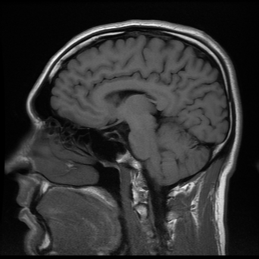

```{r setup, include = FALSE, cache = FALSE, purl = FALSE, fig.showtext = TRUE}
library(knitr)
opts_chunk$set(tidy = FALSE, warning = FALSE, message = FALSE, cache =FALSE)

source("assets/xaringan_setup.R")
library(xaringanExtra)
library(ggplot2)
use_tile_view()
use_scribble()
use_search(show_icon = FALSE)
use_progress_bar(color = "#6d2b5e", location = "bottom", height = "10px")
use_freezeframe()
# use_webcam()
# use_panelset()
# use_extra_styles(hover_code_line = TRUE)

# http://tachyons.io/docs/
# https://roperzh.github.io/tachyons-cheatsheet/
use_tachyons()
```


## Мы рассмотрим 

- Базовые идеи корреляционного анализа
- Проблему двух статистических подходов: "Тестирование гипотез vs. построение моделей"
- Разнообразие статистических моделей
- Основы регрессионного анализа

---

### Вы сможете

+ Оценить взаимосвязь между измеренными величинами
+ Объяснить что такое линейная модель
+ Формализовать запись модели в виде уравнения
+ Подобрать модель линейной регрессии
+ Протестировать гипотезы о наличии зависимости при помощи t-критерия или F-критерия
+ Оценить предсказательную силу модели 

---

class: middle, center, inverse

# Знакомимся с даными

---

## Пример: IQ и размеры мозга

Зависит ли уровень интеллекта от размера головного мозга? (Willerman et al. 1991)

.pull-left[

.small[[Scan_03_11](https://flic.kr/p/c45eZ3) by bucaorg(Paul_Burnett) on Flickr]  
]

.pull-right[
Было исследовано 20 девушек и 20 молодых людей

У каждого индивида измеряли:

- вес, 
- рост, 
- размер головного мозга (количество пикселей на изображении ЯМР сканера)
- Уровень интеллекта измеряли с помощью IQ тестов

Пример взят из работы: Willerman, L., Schultz, R., Rutledge, J. N., and Bigler, E. (1991), "In Vivo Brain Size and Intelligence," Intelligence, 15, 223-228.  
Данные представлены в библиотеке *"The Data and Story Library"* 
http://lib.stat.cmu.edu/DASL/  
]

---

## Знакомство с данными

Посмотрим на датасет:

```{r}
brain <- read.csv("data/IQ_brain.csv", header = TRUE)
head(brain)

```

Есть ли пропущенные значения?

```{r}
sum(!complete.cases(brain))
```

---

## Где пропущенные значения?

Где именно?

```{r}
sapply(brain, function(x) sum(is.na(x)))
```

Что это за случаи?

```{r}
brain[!complete.cases(brain), ]
```

Каков объём выборки?

```{r}
nrow(brain) ## Это без учета пропущенных значений
```

---

class: center, middle, inverse

# Корреляционный анализ

.pull-right[*Цель практически любого исследования* --- поиск взаимосвязи величин и создание базы для предсказания неизвестного на основе имеющихся данных]

---

## Корреляционный анализ

Наличие связи между явлениями __не означает__, что между ними существует причинно-следственная связь.    

Сила связи между явлениями может быть количественно измерена.

---

## Основные типы линейной связи между величинами

```{r linear-basic, fig.width = 12, fig.height = 8, echo = FALSE, purl=FALSE}
library (gridExtra)

x <- rnorm(100, 10, 5)
y1 <- 5*x + rnorm(100, 0, 5)
pl_pos_cor <- ggplot(data.frame(x = x, y = y1), aes(x = x, y = y)) + 
  geom_point(colour = 'steelblue') + 
  xlab('Первая величина') + ylab('Вторая величина') + 
  ggtitle('Положительная \nкорреляция') +
  theme(text = element_text(size = 20))

y2 <- -5*x + rnorm(100, 0, 5)
pl_neg_cor <- ggplot(data.frame(x = x, y = y2), aes(x = x, y = y)) + 
  geom_point(colour = 'steelblue') + 
  xlab('Первая величина') + ylab('Вторая величина') + 
  ggtitle('Отрицательная \nкорреляция') +
  theme(text = element_text(size = 20))

y3 <- 0*x + rnorm(100, 0, 5)
pl_zero_cor <- ggplot(data.frame(x = x, y = y3), aes(x = x, y = y)) + 
  geom_point(colour = 'steelblue') + 
  xlab('Первая величина') + ylab('Вторая величина') + 
  ggtitle('Корреляции \nнет') +
  theme(text = element_text(size = 20))

grid.arrange(pl_pos_cor, pl_neg_cor, pl_zero_cor, ncol = 3)
```

---

## Криволинейные связи между величинами

```{r curvilinear, fig.width = 12, fig.height = 8, echo=FALSE, purl=FALSE}
x <- rep(seq(1, 20, 1), 5)
y1 <- 10*sin(x) + rnorm(100, 0, 5)
pl_sin_cor <- ggplot(data.frame(x = x, y = y1), aes(x = x, y = y)) + 
  geom_point(colour = 'steelblue') + 
  xlab('Первая величина') + ylab('Вторая величина') +
  theme(text = element_text(size = 20)) 

y2 <- exp(x/3) + rnorm(100, 0, 50)
pl_exp_cor <- ggplot(data.frame(x = x, y = y2), aes(x = x, y = y)) + 
  geom_point(colour = 'steelblue') + 
  xlab('Первая величина') + ylab('Вторая величина') +
  theme(text = element_text(size = 20))

y3 <- exp(1 + -1*x)/(1 + exp(1 + -1*x)) + rnorm(100, 0, 0.05)
pl_log_cor <- ggplot(data.frame(x = x, y = y3), aes(x = x, y = y)) + 
  geom_point(colour = 'steelblue') + 
  xlab('Первая величина') + ylab('Вторая величина')+
  theme(text = element_text(size = 20))

grid.arrange(pl_sin_cor, pl_exp_cor, ncol = 2)
```

---

## Коэффициент ковариации

Оценивает **сонаправленность отклонений** двух величин от своих средних значений
$$cov_{x,y} = \frac{\sum(x_i-\bar{x})(y_i-\bar{y})}{n - 1}$$


Коэффициент ковариации варьирует в интервале $-\infty < cov_{x,y} < +\infty$


```{r deviations, fig.height = 5, fig.width = 11, echo=FALSE, purl=FALSE}
X_back <- rnorm(20, 0, 4)
Y_back <- rnorm(20, 1, 4)

XY <- data.frame(x = X_back, y = Y_back)

meanX <- 0
meanY <- 1
Xmin <- -5
Xmax <- 5
Ymin <- -5
Ymax <- 5

X <- 2
Y <- 4
X1 <- -2
Y1 <- -4
X2 <- 2
Y2 <- -4

ar <- arrow(type = 'closed', length = unit(0.15,'cm'))

Pl_positiv1 <- 
  ggplot() + 
  geom_point(data = XY, aes(x = x, y = y), color = "gray") + 
  geom_point(aes(x = c(meanX, X), y = c(meanY, Y))) +
  xlim(Xmin, Xmax) + ylim(Ymin, Ymax) + guides(size = 'none') + 
  geom_segment(aes(x = meanX, y = meanY, xend = X - 0.2, yend = Y - 0.2), arrow = ar) +
  geom_segment(aes(x = meanX, y = meanY, xend = meanX, yend = Ymin), linetype = 2) +
  geom_segment(aes(x = meanX, y = meanY, xend = Xmin, yend = meanY), linetype = 2) +
  geom_segment(aes(x = X, y = Y, xend = Xmin, yend = Y), linetype = 2) +
  geom_segment(aes(x = X, y = Y, xend = X, yend = Ymin), linetype = 2) +
  geom_segment(aes(x = meanX, y = Ymin, xend = X, yend = Ymin), arrow = ar, color ="red", size = 1) + 
  labs(x = 'x', y = 'y') +
  geom_segment(aes(x = Xmin, y = meanY, xend = Xmin, yend = Y), arrow = ar, color = "red", size = 1) + 
  ggtitle('Положительные\nотклонения') 


Pl_positiv2 <- 
  ggplot() + 
  geom_point(data = XY, aes(x = x, y = y), color = "gray") + 
  geom_point(aes(x = c(meanX, X1), y = c(meanY, Y1))) +
  xlim(Xmin, Xmax) + ylim(Ymin, Ymax) + guides(size = 'none') + 
  geom_segment(aes(x = meanX, y = meanY, xend = X1 + 0.2, yend = Y1 + 0.2), arrow = ar) +
  geom_segment(aes(x = meanX, y = meanY, xend = meanX, yend = Ymin), linetype = 2) +
  geom_segment(aes(x = meanX, y = meanY, xend = Xmin, yend = meanY), linetype = 2) +
  geom_segment(aes(x = X1, y = Y1, xend = Xmin, yend = Y1), linetype = 2) +
  geom_segment(aes(x = X1, y = Y1, xend = X1, yend = Ymin), linetype = 2) +
  geom_segment(aes(x = meanX, y = Ymin, xend = X1, yend = Ymin), arrow = ar, color = "blue", size = 1) + 
  geom_segment(aes(x = Xmin, y = meanY, xend = Xmin, yend = Y1), arrow = ar, color = "blue", size = 1) + 
  labs(x = 'x', y = 'y') +
  ggtitle('Отрицательные\nотклонения') 

Pl_negative <- 
  ggplot() + 
  geom_point(data = XY, aes(x = x, y = y), color = "gray") + 
  geom_point(aes(x = c(meanX, X2), y = c(meanY, Y2))) +
  xlim(Xmin, Xmax) + ylim(Ymin, Ymax) + guides(size = 'none') + 
  geom_segment(aes(x = meanX, y = meanY, xend = X2 - 0.2, yend = Y2 + 0.2), arrow = ar) +
  geom_segment(aes(x = meanX, y = meanY, xend = meanX, yend = Ymin), linetype = 2) +
  geom_segment(aes(x = meanX, y = meanY, xend = Xmin, yend = meanY), linetype = 2) +
  geom_segment(aes(x = X2, y = Y2, xend = Xmin, yend = Y2), linetype = 2) +
  geom_segment(aes(x = X2, y = Y2, xend = X, yend = Ymin), linetype = 2) +
  geom_segment(aes(x = meanX, y = Ymin, xend = X2, yend = Ymin), arrow = ar, color = "red", size = 1)+ 
  geom_segment(aes(x = Xmin, y = meanY, xend = Xmin, yend = Y2), arrow = ar, color = "blue", size = 1) + 
  labs(x = 'x', y = 'y') +
  ggtitle('Отклонения\nв разных направлениях') 

grid.arrange(Pl_positiv1, Pl_positiv2, Pl_negative, ncol = 3)
```


---

## Коэффициент корреляции

Это стандартизованное значение ковариации:

$$r_{x,y} = \frac{\sum(x_i-\bar{x})(y_i-\bar{y})} {\sqrt{\sum(x_i-\bar{x})^2}\sqrt{\sum(y_i-\bar{y})^2}} = \frac{cov_{x,y}} {\sigma_x \sigma_y}$$

Коэффициент корреляции варьирует в интервале: $-1 \le r_{x,y} \le +1$

---

## Коэффициенты корреляции и условия их применимости   

| Коэффициент                                      | Функция                                                                         | Особенности применения                                                                                    |
| ------------------------------------------------ | ------------------------------------------------------------- | --------------------------------------------------------------------------------------------------------- |
| Коэффициент Пирсона                                    | `cor(x,y,method="pearson")`                                   | Оценивает связь двух нормально распределенных величин. Выявляет только линейную составляющую взаимосвязи. |
| Ранговые коэффициенты (коэффициент Спирмена, Кендалла) | `cor(x,y,method="spearman")`<br/>`cor(x,y,method="kendall")`  | Не зависят от формы распределения. Могут оценивать связь для любых монотонных зависимостей.           |

---

## Оценка статистической значимости коэффициентов корреляции

- Коэффициент корреляции --- это статистика, значение которой описывает степень взаимосвязи двух сопряженных переменных. Следовательно, применима логика статистического критерия. 
- Нулевая гипотеза $H_0: r=0$.
- Бывают двусторонние $H_a: r\ne 0$ и односторонние критерии $H_a: r>0$ или $H_a: r<0$.
- Ошибка коэффициента Пирсона: $SE_r=\sqrt{\frac{1-r^2}{n-2}}$.
- Стандартизованная величина $t=\frac{r}{SE_r}$ подчиняется распределению Стьюдента с параметром $df = n-2$.
- Для ранговых коэффициентов существует проблема "совпадающих рангов" (tied ranks), что приводит к приблизительной оценке $r$ и приблизительной оценке уровня значимости. 
- Значимость коэффициента корреляции можно оценить пермутационным методом.

---

## Задание

+ Постройте точечную диаграмму, отражающую взаимосвязь между результатами IQ-теста (PIQ) и размером головного мозга (MRINACount)
+ Определите силу и направление связи между этими величинами
+ Оцените сатистическую значимость коэффициента корреляции Пирсона между этими двумя переменными 
+ Придумайте способ, как оценить корреляцию между всеми парами исследованных признаков

*Hint 1*: Обратите внимание на то, что в датафрейме есть пропущенные значения. Изучите, как работают с `NA` функции, вычисляющие коэффициенты корреляции. 

<!-- *Hint 2* Для построения точечной диаграммы вам понадобится `geom_point()` -->

---

## Решение

```{r pl-brain_expose, fig.width=8, fig.height=6}
pl_brain <- ggplot(brain, 
               aes(x = MRINACount, y = PIQ)) + 
  geom_point() + 
  xlab("Brain size") + 
  ylab("IQ test") +
  theme(text = element_text(size = 20))
pl_brain
```

---

## Решение
```{r}
cor.test(brain$PIQ, brain$MRINACount, method = "pearson", alternative = "two.sided")

```

---

## Решение 

```{r, size=2, tidy=TRUE}
cor(brain[,2:6], use = "pairwise.complete.obs")

```

---

##   Два подхода к исследованию: .center[<br> Тестирование гипотезы <br>VS<br> Построение модели] 

+ Проведя корреляционный анализ, мы лишь ответили на вопрос "Существует ли статистически значимая связь между величинами?"

+ Сможем ли мы, используя это знание, _предсказать_ значения одной величины, исходя из знаний другой? 

---

## Тестирование гипотезы VS построение модели 

Простейший пример: 

- Между путем, пройденным автомобилем, и временем, проведенным в движении, несомненно есть связь. Хватает ли нам этого знания?   
- Для расчета величины пути в зависимости от времени необходимо построить модель: $S=Vt$, где $S$ - зависимая величина, $t$ - независимая переменная, $V$ - параметр модели.
- Зная параметр модели (скорость) и значение независимой переменной (время), мы можем рассчитать (*cмоделировать*) величину пройденного пути.

---

class: middle, center, inverse

# Какие бывают модели?

---

## Линейные и нелинейные модели
<br>

Линейные модели 
$$y = b_0 + b_1x$$ <br> $$y = b_0 + b_1x_1 + b_2x_2$$ 
Нелинейные модели 
$$y = b_0 + b_1^x$$ <br>  $$y = b_0^{b_1x_1+b_2x_2}$$ 

---

## Простые и многокомпонентные (множественные) модели

+ Простая модель
 $$y = b_0 + b_1x$$ 

+ Множественная модель
 $$y = b_0 + b_1x_1 + b_2x_2 + b_3x_3 + ... + b_nx_n$$ 

---

## Детерминистские и стохастические модели

.pull-left[
```{r,echo=FALSE, fig.height=4, fig.width=4, warning=FALSE, purl=FALSE}
x <- 1:20
y <- 2 + 5*x
ggplot(data.frame(x=x, y=y), aes(x=x, y=y)) + geom_point(size=4)  + geom_abline(slope=5, intercept = 2) + ylim(0, 100) 
```

Модель: $у_i = 2 + 5x_i$    
Два параметра: угловой коэффициент (slope) $b_1=5$; свободный член (intercept) $b_0=2$   
Чему равен $y$ при $x=10$?
]

.pull-right[
```{r,echo=FALSE, fig.height=4, fig.width=4, warning=FALSE, purl=FALSE}
x <- 1:20
y <- 2 + 5*x + rnorm(20,0, 20)
ggplot(data.frame(x=x, y=y), aes(x=x, y=y)) + geom_point(size=4)  + geom_abline(slope=5, intercept = 2)  + ylim(0,100) + theme_bw()

```

Модель: $у_i = 2 + 5x_i + \varepsilon_i$    
Появляется дополнительный член $\varepsilon_i$ 
Он вводит в модель влияние неучтенных моделью факторов. 
Обычно считают, что $\epsilon \in N(0, \sigma^2)$ 
]

---

## Случайная и фиксированая часть модели
В стохастические модели выделяется две части:

**Фиксированная часть:** $у_i = 2 + 5x_i$   
**Случайная часть:** $\varepsilon_i$ 

Бывают модели, в которых случайная часть выглядит существенно сложнее (модели со смешанными эффектами). В таких моделях необходимо смоделировать еще и поведение случайной части.

---

## Модели с дискретными предикторами

```{r discrete, fig.height=5.5, fig.width=8, echo=FALSE}
set.seed(1234)
x <- data.frame(labels = c(rep("Level 1", 10), rep( "Level 2", 10), rep("Level 3", 10)), response = c(rnorm(10, 5, 1), rnorm(10, 10, 1), rnorm(10, 15, 1))) 

ggplot(x, aes(x=labels, y=response)) + geom_boxplot()+ geom_point(color="blue", size=4) + xlab(" ") 

```

Модель для данного примера имеет такой вид  
<br>
<br>
$response = 4.6 + 5.3I_{Level2} + 9.9 I_{Level3}$

$I_{i}$ - dummy variable   

---

## Модель для зависимости величины IQ от размера головного мозга

Какая из линий "лучше" описывает облако точек?

```{r iq-regression, echo=FALSE, fig.align='center', fig.height= 5, fig.width=7}
library(ggplot2)

pl_1 <- pl_brain + geom_smooth(method = "lm", se = FALSE, size=2) + geom_abline(slope = 0.00008, intercept = 35, color="green", size = 2) + geom_abline(slope = 0.00014, intercept =1.7, color="red", size=2) 

grid.arrange (pl_brain, pl_1, ncol=2)

```

---

class: middle, center, inverse

# Найти оптимальную модель позволяет регрессионный анализ

.pull-right[
"Essentially, all models are wrong,     
but some are useful"     
(George E. P. Box) 
]

---

## Происхождение термина "регрессия"

.pull-left[


Френсис Галтон (Francis Galton)]

.pull-right[
"the Stature of the adult offspring … [is] … more mediocre than the
stature of their Parents" (цит. по `Legendre & Legendre, 1998`)


Рост _регрессирует_ (возвращается) к популяционной средней     
Угловой коэффициент в зависимости роста потомков от роста родителей- _коэффициент регрессии_
]

---

## Подбор линии регрессии проводится с помощью двух методов 

>- С помощью метода наименьших квадратов (Ordinary Least Squares) - используется для простых линейных моделей
<br>

>- Через подбор функции максимального правдоподобия (Maximum Likelihood) - используется для подгонки сложных линейных и нелинейных моделей.

---

## Метод наименьших квадратов

.pull-left[


.small[
(из кн. Quinn, Keough, 2002, стр. 85)     
]
]

.pull-right[
Остатки (Residuals):            
$$\varepsilon_i = y_i - \hat{y_i}$$

Линия регрессии (подобранная модель) - это та линия, у которой $\sum{\varepsilon_i}^2$ минимальна.
]

---

## Подбор модели методом наименьших квадратов с помощью функци `lm()`  
`fit <- lm(formula, data)`

Модель записывается в виде формулы  

| Модель        | Формула   |
|-------------|-------------|  
| Простая линейная регрессия <br> $\hat{y_i}=b_0 + b_1x_i$ | `Y ~ X` <br> `Y ~ 1 + X` <br> `Y ~ X + 1`  |
| Простая линейная регрессия <br> (без $b_0$, "no intercept") <br> $\hat{y_i}=b_1x_i$ | `Y ~ -1 + X` <br> `Y ~ X - 1`  |
| Уменьшенная простая линейная регрессия <br> $\hat{y_i}=b_0$ | `Y ~ 1` <br> `Y ~ 1 - X`  |
| Множественная линейная регрессия <br> $\hat{y_i}=b_0 + b_1x_i +b_2x_2$ | `Y ~ X1 + X2`  |

---

## Подбор модели методом наименьших квадратов с помощью функци `lm()` 
`fit <- lm(formula, data)`

Элементы формул для записи множественных моделей

| Элемент формулы | Значение |
|-------------|-------------| 
| `:` | Взаимодействие предикторов <br> `Y ~ X1 + X2 + X1:X2` |
| `*` | Обозначает полную схему взаимодействий <br>  `Y ~ X1 * X2 * X3` <br> аналогично <br> `Y ~ X1 + X2 + X3+ X1:X2 + X1:X3 + X2:X3 + X1:X2:X3` |
| `.` | `Y ~ .` <br> В правой части формулы записываются все переменные из датафрейма, кроме `Y` | 

---

## Подберем модель, наилучшим образом описывающую зависимость результатов IQ-теста от размера головного мозга

```{r brain-mod, purl=FALSE}
brain_model <- lm(PIQ ~ MRINACount, data = brain)
brain_model
```

---

## Как трактовать значения параметров регрессионной модели?

```{r, echo=FALSE, warning=FALSE, fig.align='center',fig.width=9, fig.height=7}
n=100
x <- rnorm(n, 10, 5)
y1 <- 5*x + 50 + rnorm(n, 0, 2)
y2 <- -5*x + 50 + rnorm(n, 0, 2)
y3 <- 0*x + 50 + rnorm(n, 0, 2)
label <- c(rep("Positive slope",n), rep("Negative slope", n), rep("Zero slope", n))
df1 <- data.frame(x = rep(x, 3), y = c(y1, y2, y3), label = label)
df1a <- data.frame(intercept = c(50, 50, 50), slope = c(-5,0,5))
pl_1 <- ggplot(data = df1, aes(x = x, y = y, color = label)) + geom_point() + xlab("Independent (X)") + ylab("Dependent (Y)") + xlim(0, 25) + guides(color=F) + geom_abline(data = df1a, aes(intercept = intercept, slope = slope), size=1) + ggtitle("Constant intercepts \n Different slopes") + theme(text = element_text(size = 15))

x <- rnorm(n, 10, 5)
y1 <- 5*x + 0 + rnorm(n, 0, 2)
y2 <- 5*x + 30 + rnorm(n, 0, 2)
y3 <- 5*x + 60 + rnorm(n, 0, 2)
label <- c(rep("Intercept = 0",n), rep("Intercept = 30", n), rep("Intercept = 60", n))
df2 <- data.frame(x = rep(x, 3), y = c(y1, y2, y3), label = label)
df2a <- data.frame(intercept=c(30, 0, 60), slope=c(5, 5, 5))
pl_2 <- ggplot(df2, aes(x = x, y = y, color=label)) + geom_point() + xlab("Independent (X)") + ylab("Dependent (Y)") + xlim(0, 25) + guides(color=F) + geom_abline(data = df2a, aes(intercept = intercept, slope = slope), size=1) + ggtitle("Different intercepts \n Constant slopes") + theme(text = element_text(size = 15))


x <- rnorm(n, 10, 5)
y1 <- 0*x + 0 + rnorm(n, 0, 2)
y2 <- 0*x + 30 + rnorm(n, 0, 2)
y3 <- 0*x + 60 + rnorm(n, 0, 2)
label <- c(rep("Intercept = 0",n), rep("Intercept = 30", n), rep("Intercept = 60", n))
df3 <- data.frame(x = rep(x, 3), y = c(y1, y2, y3), label = label)
df3a <- data.frame(intercept = c(30, 0, 60), slope = c(0, 0, 0))
pl_3 <- ggplot(data = df3, aes(x = x, y = y, color=label)) + geom_point() + xlab("Independent (X)") + ylab("Dependent (Y)") + xlim(0, 25) + guides(color=F) + geom_abline(data = df3a, aes(intercept = intercept, slope = slope), size=1) + ggtitle("Different intercepts \n Zero slopes") + theme(text = element_text(size = 15))


grid.arrange(pl_1, pl_2, pl_3, nrow = 1)

```

---

## Как трактовать значения параметров регрессионной модели?

>- Угловой коэффициент (_slope_) показывает *на сколько* _единиц_ изменяется предсказанное значение $\hat{y}$ при изменении на _одну единицу_ значения предиктора $(x)$.

>- Свободный член (_intercept_) --- величина во многих случаях не имеющая "смысла", просто поправочный коэффициент, без которого нельзя вычислить $\hat{y}$. <br> _NB!_ В некоторых линейных моделях он имеет смысл, например, значения $\hat{y}$ при $x = 0$. 

>- Остатки (_residuals_) - характеризуют влияние неучтенных моделью факторов.

---

## Вопросы: 
1. Чему равны угловой коэффициент и свободный член полученной модели `brain_model`?       
2. Какое значение IQ-теста предсказывает модель для человека с объемом  мозга равным 900000?         
3. Чему равно значение остатка от модели для человека с порядковым номером 10?    

---

## Ответы

1. Чему равны угловой коэффициент и свободный член полученной модели `brain_model`?  

Угловой коэффициент:
```{r slope}
coefficients(brain_model) [1]
```

Свободный член:
```{r constant}
coefficients(brain_model) [2]
```

---

## Ответы

Какое значение IQ-теста предсказывает модель для человека с объемом  мозга равным 900000?  

```{r brain-900000}
as.numeric(coefficients(brain_model) [1] + coefficients(brain_model) [2] * 900000)
```

---

## Ответы

3. Чему равно значение остатка от модели для человека с порядковым номером 10?    

```{r human-10}
brain$PIQ[10] - fitted(brain_model)[10]
residuals(brain_model)[10]
```

---

## Углубляемся в анализ модели: функция `summary()`

```{r summary_model}
summary(brain_model)
```

---

## Что означают следующие величины?

`Estimate`  
`Std. Error`   
`t value`  
`Pr(>|t|)`   

---

## Оценки параметров регрессионной модели

| Параметр | Оценка      | Стандартная ошибка |   
|-------------|--------------------|-------------|   
| $\beta_1$ <br> Slope| $b _1 = \frac {\sum _{i=1}^{n} {[(x _i - \bar {x})(y _i - \bar {y})]}}{\sum _{i=1}^{n} {(x _i - \bar x)^2}}$<br> или проще <br> $b_0 = r\frac{sd_y}{sd_x}$ | $SE _{b _1} = \sqrt{\frac{MS _e}{\sum _{i=1}^{n} {(x _i - \bar {x})^2}}}$  | 
| $\beta_0$ <br> Intercept | $b_0 = \bar y - b_1 \bar{x}$  | $SE _{b _0} = \sqrt{MS _e [\frac{1}{n} + \frac{\bar x}{\sum _{i=1}^{n} {(x _i - \bar x)^2}}]}$ |
| $\epsilon _i$ | $e_i = y_i - \hat {y_i}$ | $\approx \sqrt{MS_e}$   

---

## Для чего нужны стандартные ошибки?

- Они нужны, поскольку мы _оцениваем_ параметры по _выборке_;
- Позволяют построить доверительные интервалы для параметров;
- Их используют в статистических тестах.

---

## Графическое представление результатов 

.pull-left[
```{r, fig.height=5, fig.width=5}
pl_brain + geom_smooth(method="lm") 
```
]

.pull-right[
Доверительная зона регрессии. В ней с 95% вероятностью лежит регрессионная прямая, описывающая связь в генеральной совокупности. 

<br>
Возникает из-за неопределенности оценок коэффициентов модели, вследствие выборочного характера оценок.           
]

---

## Зависимость в генеральной совокупности 

.pull-left[
Симулированный пример: Генеральная совокупность, в которой связь между Y и X, описывается следующей зависимостью
$$
y_i = 10 + 10x_i + \varepsilon_i \\
\varepsilon \in N(0, 20)
$$

```{r pop-code, fig.show='hide'}
pop_x <- rnorm(1000, 10, 3)
pop_y <- 10 + 10*pop_x + rnorm(1000, 0, 20)
population <- data.frame(x = pop_x, y = pop_y)

pop_plot <- ggplot(population, aes(x = x, y = y)) + 
  geom_point(alpha = 0.3, color = "red") + 
  geom_abline(aes(intercept = 10, slope = 10), 
              color="blue", size = 2) +
  theme(text = element_text(size = 15))
pop_plot
```
]

.pull-right[
```{r pop-plot, echo = FALSE, fig.height = 5}
pop_plot 
```
]

---

## Зависимости, выявленные в нескольких разных выборках 

.pull-left[
Линии регрессии, полученные для 100 выборок (по 20 объектов в каждой), взятых из одной и той же генеральной совокупности.
]

.pull-right[

```{r, echo=FALSE, fig.align='center', fig.width=6, fig.height = 6, purl = FALSE}
samp_coef <- data.frame(b0 = rep(NA, 100), b1=rep(NA, 100))
for(i in 1:100) {
  samp_num <- sample(1:1000, 20)
  samp <- population[samp_num, ]
  fit <- lm(y~x, data=samp)
  samp_coef$b0[i] <- coef(fit)[1]
  samp_coef$b1[i] <- coef(fit)[2]
  
 }

ggplot(population, aes(x=x, y=y)) + geom_point(alpha=0.3, color="red")+ geom_abline(aes(intercept=b0, slope=b1), data=samp_coef) + geom_abline(aes(intercept=10, slope=10), color="blue", size=2) +
  theme(text = element_text(size = 18))
```
]

---

## Доверительные интервалы для коэффициентов уравнения регрессии

```{r}
coef(brain_model)

confint(brain_model)
```

---

## Для разных $\alpha$ можно построить разные доверительные интервалы

```{r , echo=FALSE, fig.align='center', fig.height=7, fig.width = 10}
pl_alpha1 <- pl_brain + geom_smooth(method="lm", level=0.8) + ggtitle(bquote(alpha==0.2))

pl_alpha2 <- pl_brain + geom_smooth(method="lm", level=0.95) + ggtitle(bquote(alpha==0.05))

pl_alpha3 <- pl_brain + geom_smooth(method="lm", level=0.999) + ggtitle(bquote(alpha==0.01))


grid.arrange(pl_alpha1, pl_alpha2, pl_alpha3, ncol=3)

```

---

## Важно!

Если коэффициенты уравнения регрессии --- лишь приблизительные оценки параметров, то предсказать значения зависимой переменной можно только _с нeкоторой вероятностью_.           

---

## Какое значение IQ можно ожидать у человека с размером головного мозга 900000?

```{r, tidy=TRUE}
newdata <- data.frame(MRINACount = 900000)

predict(brain_model, newdata, 
        interval = "prediction", 
        level = 0.95, se = TRUE)$fit

```

--

>- При размере мозга 900000 среднее значение IQ будет, с вероятностью 95%, находиться в интервале от 67 до 153.

---

## Отражаем на графике область значений, в которую попадут 95% предсказанных величин IQ

Подготавливаем данные:

```{r , warning=FALSE}
brain_predicted <- predict(brain_model, interval="prediction")
brain_predicted <- data.frame(brain, brain_predicted)
head(brain_predicted)
```

---

## Отражаем на графике область значений, в которую попадут 95% предсказанных величин IQ

```{r pl-predict, echo=FALSE, fig.align='center', fig.height=7, fig.width=11}
pl_brain + 

# 1) Линия регрессии и ее дов. интервал
# Если мы указываем fill внутри aes() и задаем фиксированное значение - появится соотв. легенда с названием.
# alpha - задает прозрачность
  geom_smooth(method = "lm", aes(fill = "Conf.interval"), alpha = 0.4) +
# 2) Интервал предсказаний создаем при помощи геома ribbon ("лента")
# Данные берем из другого датафрейма - из brain_predicted
# ymin и ymax - эстетики геома ribbon, которые задают нижний и верхний край ленты в точках с заданным x (x = MRINACount было задано в ggplot() при создании pl_brain, поэтому сейчас его указывать не обязательно)
  geom_ribbon(data = brain_predicted,  aes(ymin = lwr, ymax = upr, fill = "Conf. area for prediction"), alpha = 0.2) +

# 3) Вручную настраиваем цвета заливки при помощи шкалы fill_manual.
# Ее аргумент name - название соотв. легенды, values - вектор цветов
  scale_fill_manual(name = "Intervals", values = c("green", "gray")) +

# 4) Название графика
  ggtitle("Confidence interval \n and confidence area for prediction")
```

---

## Код для построения графика


```{r echo=TRUE, eval=FALSE}
pl_brain + 

# 1) Линия регрессии и ее дов. интервал
# Если мы указываем fill внутри aes() и задаем фиксированное значение - 
#  появится соотв. легенда с названием.
# alpha - задает прозрачность
  geom_smooth(method = "lm", aes(fill = "Conf.interval"), alpha = 0.4) +
# 2) Интервал предсказаний создаем при помощи геома ribbon ("лента")
# Данные берем из другого датафрейма - из brain_predicted
# ymin и ymax - эстетики геома ribbon, которые задают нижний и верхний 
# край ленты в точках с заданным x (x = MRINACount было задано в ggplot() 
# при создании pl_brain, поэтому сейчас его указывать не обязательно)
#

geom_ribbon(data = brain_predicted,  aes(ymin = lwr, ymax = upr, fill = "Conf. area for prediction"), alpha = 0.2) +
# 3) Вручную настраиваем цвета заливки при помощи шкалы fill_manual.
# Ее аргумент name - название соотв. легенды, values - вектор цветов
  scale_fill_manual(name = "Intervals", values = c("green", "gray")) +
# 4) Название графика
  ggtitle("Confidence interval \n and confidence area for prediction")
```

---

## Важно! 

.pull-left-33[
Модель "работает" только в том диапазоне значений независимой переменной $(x)$, для которой она построена (интерполяция). Экстраполяцию надо применять с большой осторожностью.
]

.pull-right-66[
```{r lm-model, fig.align='center', fig.height=6, fig.width=12, echo=FALSE}
pl_brain + 
  geom_ribbon(data=brain_predicted, aes(y=fit, ymin=lwr, ymax=upr, fill = "Conf. area for prediction"), alpha=0.2) + 
  geom_smooth(method="lm", aes(fill="Conf.interval"), alpha=0.4) + 
  scale_fill_manual("Intervals", values = c("green", "gray")) + 
  ggtitle("Confidence interval \n and confidence area for prediction")+ xlim(600000, 1300000) + geom_text(label="Interpolation", aes(x=950000, y=100)) + geom_text(label="Extrapolation", aes(x=700000, y=70)) +
geom_text(label="Extrapolation", aes(x=1200000, y=70))

``` 
]

---

## Итак, что означают следующие величины?

>- `Estimate` 
>- Оценки праметров регрессионной модели 
>- `Std. Error`   
>- Стандартная ошибка для оценок    
>- Осталось решить, что такое `t value`, `Pr(>|t|)`

---

## Summary

> - Модель простой линейной регрессии $y _i = \beta _0 + \beta _1 x _i + \epsilon _i$
- Параметры модели оцениваются на основе выборки
- В оценке коэффициентов регрессии и предсказанных значений существует неопределенность: необходимо вычислять доверительный интервал. 
- Доверительные интервалы можно расчитать, зная стандартные ошибки.  

---

## Что почитать

+ Гланц, С., 1998. Медико-биологическая статистика. М., Практика
+ Кабаков Р.И. R в действии. Анализ и визуализация данных на языке R. М.: ДМК Пресс, 2014
+ Diez, D.M., Barr, C.D. and Çetinkaya-Rundel, M., 2015. OpenIntro Statistics. OpenIntro.
+ Zuur, A., Ieno, E.N. and Smith, G.M., 2007. Analyzing ecological data. Springer Science & Business Media.
+ Quinn G.P., Keough M.J. 2002. Experimental design and data analysis for biologists
+ Logan M. 2010. Biostatistical Design and Analysis Using R. A Practical Guide
